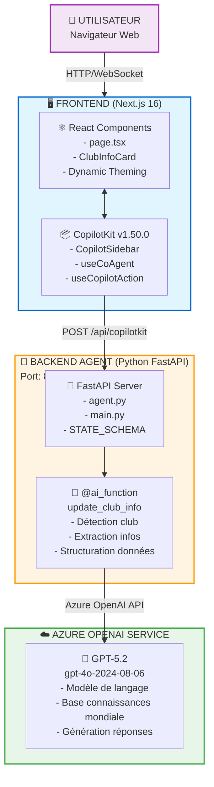
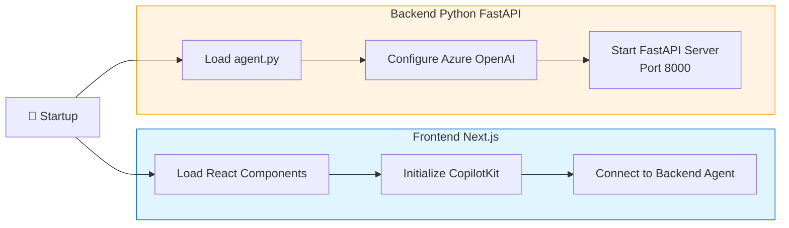
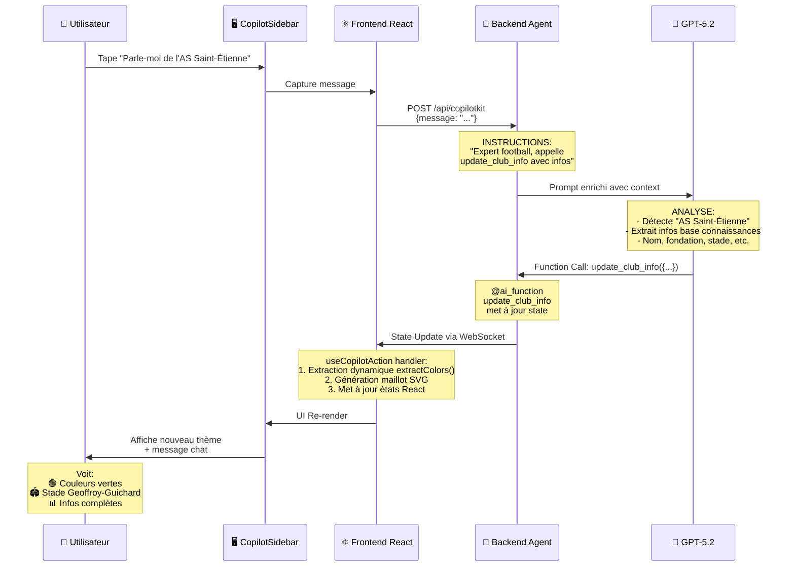
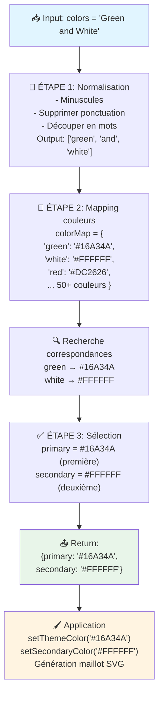
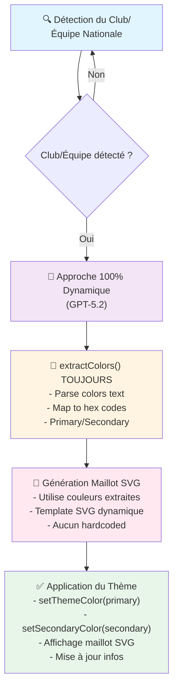

# 📐 Architecture de l'Application Football Club Theme

> **Application de thématisation 100% dynamique basée sur TOUS les clubs de football du monde**  
> Utilise l'intelligence artificielle (GPT-5.2) pour détecter les clubs et générer automatiquement l'interface

---

## 🎯 Vue d'Ensemble

Cette application est une **interface web 100% dynamique** qui change automatiquement de thème (couleurs, maillot SVG, informations) en fonction du club de football mentionné par l'utilisateur dans le chat. Elle combine **Next.js**, **CopilotKit** (AG-UI), **Python FastAPI** et **Azure OpenAI GPT-5.2** pour créer une expérience interactive enrichie.

### Caractéristiques Principales

- ✅ **Support universel** : TOUS les clubs de football du monde (aucune liste hardcodée)
- ✅ **100% dynamique** : Couleurs extraites via GPT-5.2, maillot généré en SVG
- ✅ **Base de connaissances GPT-5.2** : Informations détaillées sur n'importe quel club
- ✅ **Interface dynamique** : Changement automatique de couleurs, maillot SVG, fond
- ✅ **Extraction intelligente** : Couleurs primaires/secondaires depuis description texte (50+ couleurs mappées)
- ✅ **Visualisation SVG** : Maillot généré dynamiquement avec les couleurs du club
- ✅ **Chat conversationnel** : Expert football qui raconte l'histoire des clubs
- ✅ **Traduction française** : Histoire du club TOUJOURS en français (même pour clubs étrangers)
- ✅ **Restriction thématique** : Agent ne répond QUE aux questions sur les clubs de foot
- ✅ **Page d'accueil attractive** : Écran de bienvenue avec exemples de clubs

---

## 🏗️ Architecture Macro



---

## 🔬 Architecture Micro - Flow Détaillé

### 1️⃣ Initialisation de l'Application



### 2️⃣ Interaction Utilisateur → Détection de Club



### 3️⃣ Extraction de Couleurs (Fonction extractColors)



### 4️⃣ Génération du Maillot SVG

```
┌─────────────────────────────────────────────────────────────────┐
│  Composant: SVG Jersey Generator                                 │
│                                                                  │
│  Input:                                                          │
│  - themeColor: "#16A34A" (vert)                                  │
│  - secondaryColor: "#FFFFFF" (blanc)                             │
└───────────────────────────┬─────────────────────────────────────┘
                            │
                            ▼
┌─────────────────────────────────────────────────────────────────┐
│  Structure SVG (Vertical Split Design)                           │
│                                                                  │
│  <svg viewBox="0 0 200 240">                                     │
│    <!-- MOITIÉ GAUCHE (Primary Color) -->                        │
│    <rect x="0" y="40" width="100" height="180" fill="#16A34A"/> │
│                                                                  │
│    <!-- MOITIÉ DROITE (Secondary Color) -->                      │
│    <rect x="100" y="40" width="100" height="180" fill="#FFF"/>  │
│                                                                  │
│    <!-- COL (Même couleurs) -->                                  │
│    <rect x="50" y="10" width="50" height="30" fill="#16A34A"/>  │
│    <rect x="100" y="10" width="50" height="30" fill="#FFFFFF"/> │
│                                                                  │
│    <!-- MANCHES -->                                              │
│    <ellipse cx="20" cy="80" rx="25" ry="60" fill="#16A34A"/>    │
│    <ellipse cx="180" cy="80" rx="25" ry="60" fill="#FFFFFF"/>   │
│  </svg>                                                          │
│                                                                  │
│  RÉSULTAT VISUEL:                                                │
│       ┌─────┬─────┐                                              │
│       │ V │ B │  (Col)                                           │
│   ┌───┴─────┴───┐                                                │
│  ●│ V │ B │● (Manches)                                          │
│   │ V │ B │                                                     │
│   │ V │ B │                                                     │
│   └─────┴─────┘                                                  │
│   V = Vert (#16A34A)                                             │
│   B = Blanc (#FFFFFF)                                            │
└─────────────────────────────────────────────────────────────────┘
```

---

## 📊 Architecture des Données

### État Partagé (AgentState)

```typescript
interface AgentState {
  clubInfo: {
    name: string;          // Nom du club
    founded: string;       // Année de fondation
    stadium: string;       // Nom du stade
    capacity: string;      // Capacité du stade
    country: string;       // Pays (texte, ex: "France")
    countryFlag: string;   // Pays (sera identique à country)
    titles: string[];      // Liste des titres/trophées
    legends: Array<{       // Légendes du club
      name: string;
      position: string;
      years: string;
    }>;
    history: string;       // Histoire complète du club
    colors: string;        // Description textuelle des couleurs
  } | null;
}
```

### État Local React (page.tsx)

```typescript
const [themeColor, setThemeColor] = useState("#1E40AF");         // Couleur primaire
const [secondaryColor, setSecondaryColor] = useState("#FFFFFF"); // Couleur secondaire
const [clubLogo, setClubLogo] = useState<string | null>(null);   // Toujours null (maillot SVG)
const [clubName, setClubName] = useState("");                    // Nom du club
const [backgroundImage, setBackgroundImage] = useState("");      // Toujours "" (gradient)
const [countryFlag, setCountryFlag] = useState("");              // Nom du pays
```

### Stratégie de Thème (100% Dynamique)

```typescript
// PLUS DE clubThemes hardcodés - Supprimés pour approche 100% dynamique
// L'application utilise UNIQUEMENT extractColors() et GPT-5.2

// Processus dynamique :
// 1. GPT détecte le club et retourne club_info.colors = "Red and White"
// 2. Frontend appelle extractColors("Red and White")
// 3. extractColors retourne { primary: "#DC143C", secondary: "#F5F5F5" }
// 4. setThemeColor("#DC143C"), setSecondaryColor("#F5F5F5")
// 5. Génération du maillot SVG avec ces couleurs
```

---

## 🔄 Flux de Communication Complet

```mermaid
sequenceDiagram
    participant User as 👤 USER<br/>Browser
    participant React as ⚛️ REACT<br/>Next.js
    participant Python as 🐍 PYTHON<br/>FastAPI
    participant GPT as 🧠 GPT<br/>5.2
    
    User->>React: 1️⃣ Tape message<br/>"ASSE ?"
    
    React->>Python: 2️⃣ POST /api/copilotkit<br/>{message: "ASSE ?"}
    
    Python->>GPT: 3️⃣ Enrichit prompt<br/>avec context + tools
    
    GPT->>Python: 4️⃣ Analyse + Call<br/>update_club_info({...})
    
    Python->>React: 5️⃣ State update<br/>{clubInfo: {...}}
    
    Note over React: 6️⃣ useCopilotAction<br/>handler() exec:<br/>- extractColors() TOUJOURS appelée<br/>- Génération maillot SVG<br/>- Mise à jour états React
    
    React->>User: 7️⃣ UI Update<br/>- Couleurs ✅<br/>- Maillot ✅<br/>- Infos ✅
    
    Python->>React: 8️⃣ Send text msg<br/>"Allez les Verts !..."
    
    React->>User: 9️⃣ Affiche msg<br/>dans le chat
    
    style User fill:#f3e5f5
    style React fill:#e1f5ff
    style Python fill:#fff4e1
    style GPT fill:#e8f5e9
```

---

## 🧩 Composants Principaux

### Frontend (Next.js + TypeScript)

#### 1. `src/app/page.tsx` (Composant Principal)

**Responsabilités :**
- Initialise CopilotKit et la connexion à l'agent
- Gère les états locaux (couleurs, logo, nom du club)
- Définit les actions CopilotKit (`update_club_info`)
- Contient la logique d'extraction de couleurs (`extractColors`)
- Affiche l'interface complète (titre, maillot, cartes d'info)

**Fonctions Clés :**
```typescript
// Extraction de couleurs depuis texte
function extractColors(colorsText: string): { primary: string; secondary: string }

// Action CopilotKit pour mise à jour du club
useCopilotAction({
  name: "update_club_info",
  handler({ club_info }) {
    // Applique le thème dynamique (extractColors TOUJOURS appelée)
    // Met à jour les états React
    // Génère maillot SVG
  }
})
```

#### 2. `src/components/clubinfo.tsx` (Carte d'Informations)

**Responsabilités :**
- Affiche les informations du club (fondation, stade, couleurs, pays)
- Affiche l'histoire du club
- Affiche le palmarès (titres/trophées)
- Affiche les légendes du club

**Structure :**
```tsx
<ClubInfoCard clubData={state.clubInfo} themeColor={themeColor}>
  - Grid 4 colonnes : Fondé, Stade, Couleurs, Pays
  - Section Histoire
  - Section Palmarès
  - Section Légendes
</ClubInfoCard>
```

#### 3. `src/lib/types.ts` (Définitions TypeScript)

**Types Définis :**
```typescript
interface AgentState {
  clubInfo: ClubInfo | null;
}

interface ClubInfo {
  name: string;
  founded: string;
  stadium: string;
  capacity: string;
  country: string;
  countryFlag: string;
  titles: string[];
  legends: Legend[];
  history: string;
  colors: string;
}
```

### Backend (Python + FastAPI)

#### 1. `agent/src/agent.py` (Logique de l'Agent)

**Responsabilités :**
- Définit le schéma d'état (`STATE_SCHEMA`)
- Configure les instructions pour GPT-5.2
- Définit la fonction `@ai_function: update_club_info`
- Gère les exemples de conversation

**Code Clé :**
```python
# Schéma de l'état partagé
STATE_SCHEMA = {
    "clubInfo": {
        "type": "object",
        "properties": {
            "name": {"type": "string"},
            "founded": {"type": "string"},
            "stadium": {"type": "string"},
            "capacity": {"type": "string"},
            "country": {"type": "string"},
            "countryFlag": {"type": "string"},
            "colors": {"type": "string"},
            "titles": {"type": "array", "items": {"type": "string"}},
            "legends": {"type": "array"},
            "history": {"type": "string"}
        }
    }
}

# Fonction AI appelée par GPT
@ai_function()
def update_club_info(state: AgentState, club_info: dict) -> AgentState:
    """Met à jour les informations du club détecté"""
    state.clubInfo = club_info
    return state
```

**Instructions pour GPT-5.2 :**
```python
INSTRUCTIONS = """
🚨 RESTRICTION STRICTE - CRITICAL 🚨
Tu es EXCLUSIVEMENT un expert en clubs de football. Tu ne réponds QUE aux questions sur le football.

❌ SUJETS INTERDITS (Refuse poliment) :
Si l'utilisateur demande météo, politique, code, science, musique, films, ou TOUT sujet non-football :
→ Réponse : "Je suis spécialisé uniquement dans les clubs de football. Parle-moi d'un club ! ⚽"

✅ SUJETS AUTORISÉS :
- Clubs de football mondiaux
- Histoire, stades, légendes, titres
- Joueurs, entraîneurs, matchs
- Rivalités, derbies, ligues

Tu es un expert en football mondial. Quand l'utilisateur mentionne un club :

1. APPELLE update_club_info avec TOUTES les informations
2. ENVOIE un message texte enthousiaste après

🇫🇷 EXIGENCE CRITIQUE : TRADUCTION FRANÇAISE 🇫🇷
Le champ "history" doit TOUJOURS être écrit en FRANÇAIS, peu importe :
- La langue de l'utilisateur (anglais, espagnol, allemand, etc.)
- Le pays du club (Angleterre, Espagne, Italie, Brésil, etc.)
- La langue de la conversation

EXEMPLES :
- Manchester United history → En français : "Manchester United, fondé en 1878, est l'un des clubs les plus titrés d'Angleterre..."
- FC Barcelona history → En français : "Le FC Barcelone, fondé en 1899, est un symbole de la Catalogne..."
- Bayern Munich history → En français : "Le Bayern Munich, fondé en 1900, est le club le plus titré d'Allemagne..."

Informations OBLIGATOIRES :
- name : Nom officiel du club
- founded : Année de fondation
- stadium : Nom du stade
- capacity : Capacité en nombre de places
- colors : Description textuelle (ex: "Red and White")
- country : Nom du pays (ex: "England", "Spain", "Germany")
- countryFlag : Emoji drapeau (🇫🇷 🏴󠁧󠁢󠁥󠁮󠁧󠁿 🇪🇸 🇩🇪 etc.)
- titles : Liste des principaux titres
- legends : 3 joueurs légendaires avec position et années
- history : 🇫🇷 DOIT ÊTRE EN FRANÇAIS - Paragraphe sur l'histoire du club

EXEMPLES :
- Manchester United → country: "England", countryFlag: "🏴󠁧󠁢󠁥󠁮󠁧󠁿", history en FRANÇAIS
- FC Barcelona → country: "Spain", countryFlag: "🇪🇸", history en FRANÇAIS
- Bayern Munich → country: "Germany", countryFlag: "🇩🇪", history en FRANÇAIS
"""
```

#### 2. `agent/src/main.py` (Serveur FastAPI)

**Responsabilités :**
- Démarre le serveur FastAPI sur le port 8000
- Configure les endpoints
- Gère les connexions CORS
- Intègre l'agent avec CopilotKit

**Configuration :**
```python
from fastapi import FastAPI
from copilotkit.integrations.fastapi import add_fastapi_endpoint
from agent import my_agent

app = FastAPI()

# Endpoint CopilotKit
add_fastapi_endpoint(app, my_agent, "/copilotkit")

# Démarrage: uvicorn main:app --host 0.0.0.0 --port 8000
```

---

## 🌐 Endpoints et APIs

### Frontend → Backend

**Endpoint Principal :**
```
POST http://localhost:8000/copilotkit
Content-Type: application/json

Body: {
  "messages": [
    {
      "role": "user",
      "content": "Parle-moi de l'AS Saint-Étienne"
    }
  ],
  "state": {
    "clubInfo": null
  }
}

Response: {
  "messages": [
    {
      "role": "assistant",
      "content": "Allez les Verts ! 💚⚪ L'AS Saint-Étienne..."
    }
  ],
  "state": {
    "clubInfo": {
      "name": "AS Saint-Étienne",
      "founded": "1919",
      ...
    }
  },
  "function_calls": [
    {
      "name": "update_club_info",
      "arguments": { ... }
    }
  ]
}
```

### Backend → Azure OpenAI

**Endpoint Azure :**
```
POST https://[DEPLOYMENT_NAME].openai.azure.com/openai/deployments/[MODEL]/chat/completions?api-version=2024-08-01-preview

Headers:
  api-key: [AZURE_OPENAI_API_KEY]
  Content-Type: application/json

Body: {
  "messages": [
    {
      "role": "system",
      "content": "[INSTRUCTIONS DE L'AGENT]"
    },
    {
      "role": "user",
      "content": "Parle-moi de l'AS Saint-Étienne"
    }
  ],
  "functions": [
    {
      "name": "update_club_info",
      "description": "Met à jour les informations du club",
      "parameters": { ... }
    }
  ]
}

Response: {
  "choices": [
    {
      "message": {
        "role": "assistant",
        "content": null,
        "function_call": {
          "name": "update_club_info",
          "arguments": "{\"name\":\"AS Saint-Étienne\",\"founded\":\"1919\",...}"
        }
      }
    }
  ]
}
```

---

## 🎨 Système de Thématisation

### Stratégie de Thème (100% Dynamique)



### Mapping de Couleurs (extractColors)

**Couleurs Supportées (50+) :**
```typescript
const colorMap: Record<string, string> = {
  // Primaires
  "red": "#DC2626", "rouge": "#DC2626",
  "blue": "#2563EB", "bleu": "#2563EB",
  "green": "#16A34A", "vert": "#16A34A",
  "yellow": "#FBBF24", "jaune": "#FBBF24",
  "white": "#FFFFFF", "blanc": "#FFFFFF",
  "black": "#000000", "noir": "#000000",
  
  // Secondaires
  "orange": "#F97316",
  "purple": "#9333EA", "violet": "#9333EA",
  "pink": "#EC4899", "rose": "#EC4899",
  "gold": "#F59E0B", "or": "#F59E0B",
  
  // Nuances
  "sky": "#0EA5E9", "ciel": "#0EA5E9",
  "navy": "#1E3A8A", "marine": "#1E3A8A",
  "burgundy": "#991B1B", "bordeaux": "#991B1B",
  "forest": "#065F46", "forêt": "#065F46",
  
  // Spéciaux
  "silver": "#D1D5DB", "argent": "#D1D5DB",
  "bronze": "#CD7F32",
  "maroon": "#7C2D12",
  "teal": "#0D9488",
  
  // ... et bien d'autres
};
```

**Algorithme d'Extraction :**
```typescript
function extractColors(colorsText: string) {
  // 1. Normalisation
  const normalized = colorsText.toLowerCase()
    .replace(/[^\w\s]/g, ' ')
    .split(/\s+/);
  
  // 2. Recherche de couleurs
  const foundColors: string[] = [];
  for (const word of normalized) {
    if (colorMap[word]) {
      foundColors.push(colorMap[word]);
    }
  }
  
  // 3. Sélection Primary/Secondary
  return {
    primary: foundColors[0] || "#2563EB",
    secondary: foundColors[1] || foundColors[0] || "#FFFFFF"
  };
}
```

---

## 🔐 Configuration et Environnement

### Variables d'Environnement (Backend)

```bash
# agent/.env
AZURE_OPENAI_API_KEY=your_api_key_here
AZURE_OPENAI_ENDPOINT=https://your-resource.openai.azure.com/
AZURE_OPENAI_DEPLOYMENT_NAME=gpt-4o-2024-08-06
AZURE_OPENAI_API_VERSION=2024-08-01-preview
```

### Scripts de Démarrage

#### Frontend (Next.js)
```bash
# my-ag-ui-app/
npm run dev
# ou
npm run dev -- --turbopack  # Avec Turbopack
```

#### Backend (Python)
```bash
# agent/
python -m uvicorn main:app --host 0.0.0.0 --port 8000 --reload
```

#### Scripts Automatisés
```bash
# Windows
scripts/setup-agent.bat   # Installation des dépendances Python
scripts/run-agent.bat     # Lancement de l'agent

# Linux/Mac
scripts/setup-agent.sh
scripts/run-agent.sh
```

---

## 📦 Dépendances

### Frontend (`package.json`)

```json
{
  "dependencies": {
    "next": "16.0.8",
    "react": "19.2.1",
    "react-dom": "19.2.1",
    "@copilotkit/react-core": "^1.50.0",
    "@copilotkit/react-ui": "^1.50.0",
    "@copilotkit/runtime": "^1.50.0",
    "@copilotkit/runtime-client-gql": "^1.50.0",
    "@copilotkit/shared": "^1.50.0"
  },
  "devDependencies": {
    "typescript": "^5",
    "@types/node": "^20",
    "@types/react": "^19",
    "@types/react-dom": "^19",
    "tailwindcss": "^3.4.1"
  }
}
```

### Backend (`pyproject.toml`)

```toml
[project]
name = "agent"
version = "0.1.0"
dependencies = [
    "fastapi>=0.115.6",
    "uvicorn[standard]>=0.32.1",
    "copilotkit>=0.1.33",
    "openai>=1.59.6",
    "python-dotenv>=1.0.1",
    "azure-ai-inference>=1.0.0b7"
]
```

---

## 🚀 Déploiement et Production

### Checklist de Production

#### Frontend
```bash
# Build de production
npm run build

# Test du build
npm start

# Variables d'environnement production
NEXT_PUBLIC_COPILOT_RUNTIME_URL=https://your-backend.com/copilotkit
```

#### Backend
```bash
# Optimisations production
uvicorn main:app --host 0.0.0.0 --port 8000 --workers 4

# Docker (optionnel)
FROM python:3.11-slim
COPY . /app
WORKDIR /app
RUN pip install -e .
CMD ["uvicorn", "main:app", "--host", "0.0.0.0", "--port", "8000"]
```

### Considérations de Sécurité

1. **API Keys** : Ne JAMAIS commit les clés Azure dans le code
2. **CORS** : Configurer les origines autorisées en production
3. **Rate Limiting** : Limiter les appels à l'API OpenAI
4. **Validation** : Valider toutes les entrées utilisateur
5. **HTTPS** : Toujours utiliser HTTPS en production

---

## 📈 Monitoring et Logging

### Logs Frontend

```typescript
// Debug logs dans page.tsx
console.log("🎯 FRONTEND ACTION - update_club_info appelé avec:", club_info);
console.log("🌍 Pays détecté:", countryName);
console.log("🎨 Application du thème:", theme);
console.log("🎨 Génération dynamique des couleurs depuis:", club_info.colors);
```

### Logs Backend

```python
# Logging dans agent.py
import logging

logger = logging.getLogger(__name__)
logger.info(f"Club détecté: {club_info['name']}")
logger.debug(f"État complet: {state}")
```

### Métriques à Surveiller

- ⏱️ **Latence** : Temps de réponse GPT-5.2 (< 2s idéal)
- 📊 **Taux de succès** : % de clubs correctement détectés
- 💰 **Coûts API** : Nombre de tokens consommés par Azure OpenAI
- 🔄 **Requêtes/min** : Charge sur le backend
- ❌ **Erreurs** : Taux d'échec des requêtes

---

## 🐛 Debugging et Troubleshooting

### Problèmes Courants

#### 1. "Club non détecté"
```
Cause : GPT-5.2 n'a pas appelé update_club_info
Solution : Vérifier les instructions dans agent.py
          Ajouter des exemples spécifiques au club
```

#### 2. "Couleurs incorrectes"
```
Cause : extractColors() ne trouve pas les couleurs
Solution : Ajouter les couleurs manquantes dans colorMap
          Vérifier club_info.colors depuis le backend
```

#### 3. "Pas de réponse dans le chat"
```
Cause : Agent appelle la fonction mais n'envoie pas de message
Solution : Vérifier BEHAVIOR dans agent.py
          S'assurer que GPT envoie bien un message texte après
```

#### 4. "Erreur CORS"
```
Cause : Frontend (localhost:3000) bloqué par CORS
Solution : Configurer CORS dans main.py FastAPI
          allow_origins=["http://localhost:3000"]
```

### Outils de Debug

**Console du Navigateur (F12) :**
```javascript
// Inspecter l'état CopilotKit
console.log("État agent:", useCopilotContext().state);

// Vérifier les couleurs extraites
console.log("Couleurs:", extractColors("Red and Blue"));
```

**Logs Python :**
```python
# Activer logs détaillés
logging.basicConfig(level=logging.DEBUG)
```

---

## 📚 Exemples d'Équipes Supportées

### Approche 100% Dynamique

L'application supporte **TOUTES** les équipes de football dans le monde grâce à GPT-5.2 :

#### Clubs de Football
- ⚽ **Angleterre** : Manchester United, Liverpool, Chelsea, Arsenal, etc.
- ⚽ **Espagne** : FC Barcelona, Real Madrid, Atlético Madrid, etc.
- ⚽ **Allemagne** : Bayern Munich, Borussia Dortmund, etc.
- ⚽ **Italie** : Juventus, AC Milan, Inter Milan, etc.
- ⚽ **France** : Paris Saint-Germain, Olympique de Marseille, AS Saint-Étienne, etc.
- ⚽ **Amérique du Sud** : Boca Juniors, River Plate, Flamengo, Palmeiras, etc.
- ⚽ **Tous les autres clubs du monde...**

#### Équipes Nationales
- 🏆 **Coupe du Monde** : Brazil, Germany, France, Argentina, Spain, etc.
- 🏆 **Euro** : France, Spain, Germany, Italy, England, etc.
- 🏆 **Copa América** : Brazil, Argentina, Uruguay, Chile, etc.
- 🏆 **Toutes les équipes nationales FIFA...**

> **Note** : Aucune limite - GPT-5.2 connaît tous les clubs et équipes nationales du monde

---

## 🔮 Améliorations Futures

### Court Terme
- [ ] Améliorer l'extraction de couleurs (nuances, dégradés)
- [ ] Animations de transition entre équipes
- [ ] Mode sombre/clair
- [ ] Optimisation des réponses GPT

### Moyen Terme
- [ ] Base de données de logos de clubs/équipes
- [ ] API de statistiques en temps réel
- [ ] Comparaison d'équipes côte à côte
- [ ] Historique des équipes consultées
- [ ] Support multi-langues (actuellement français forcé)

### Long Terme
- [ ] Intégration avec APIs de ligues officielles
- [ ] Prédictions de matchs
- [ ] Réalité augmentée pour les maillots
- [ ] Mode multijoueur avec chat partagé

---

## 📝 Conclusion

Cette application démontre une architecture moderne et scalable combinant :
- ✅ **Frontend réactif** avec Next.js et React 19
- ✅ **Backend intelligent** avec Python FastAPI
- ✅ **IA générative** avec Azure OpenAI GPT-5.2
- ✅ **Framework conversationnel** avec CopilotKit
- ✅ **Thématisation dynamique** avec extraction de couleurs
- ✅ **Support universel** pour tous les clubs du monde

L'architecture est conçue pour être :
- 🚀 **Performante** : Temps de réponse < 2s
- 🔧 **Maintenable** : Code modulaire et bien structuré
- 📈 **Scalable** : Peut gérer des milliers de clubs
- 🛡️ **Robuste** : Gestion d'erreurs et fallbacks
- 🎨 **Extensible** : Facile d'ajouter de nouvelles fonctionnalités

---

**Auteur :** Architecture générée automatiquement  
**Date :** 8 Janvier 2026  
**Version :** 1.0.0  
**Technologies :** Next.js 16, React 19, CopilotKit 1.50, FastAPI, Azure OpenAI GPT-5.2
