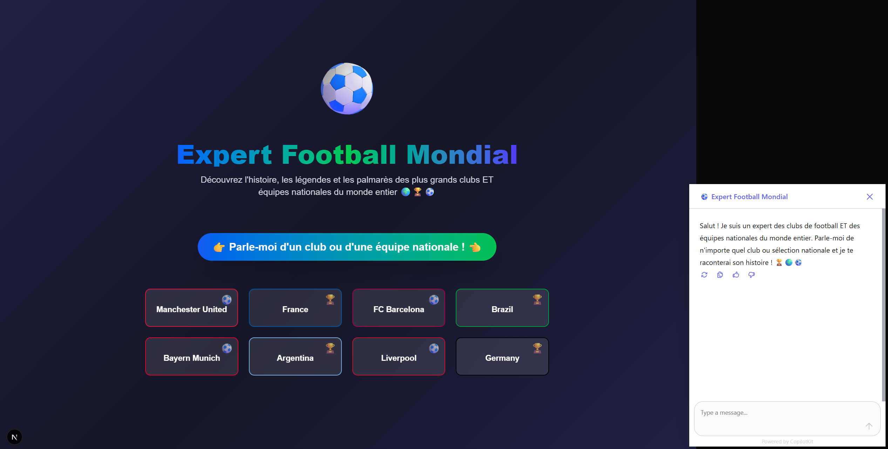
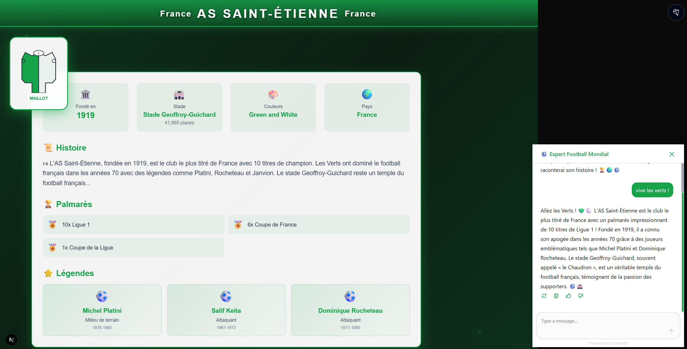
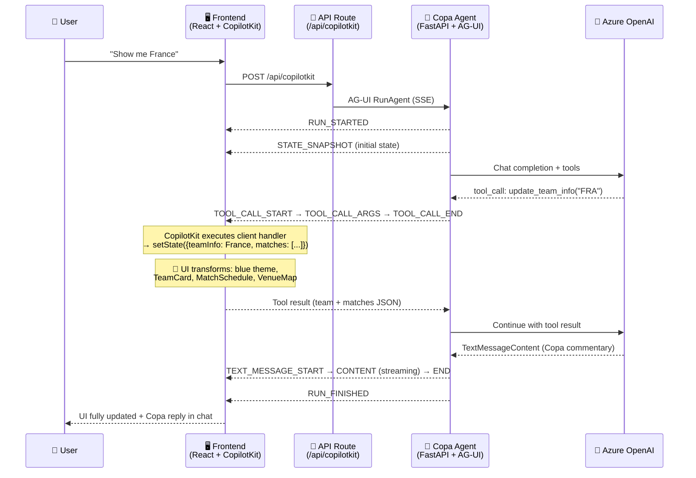
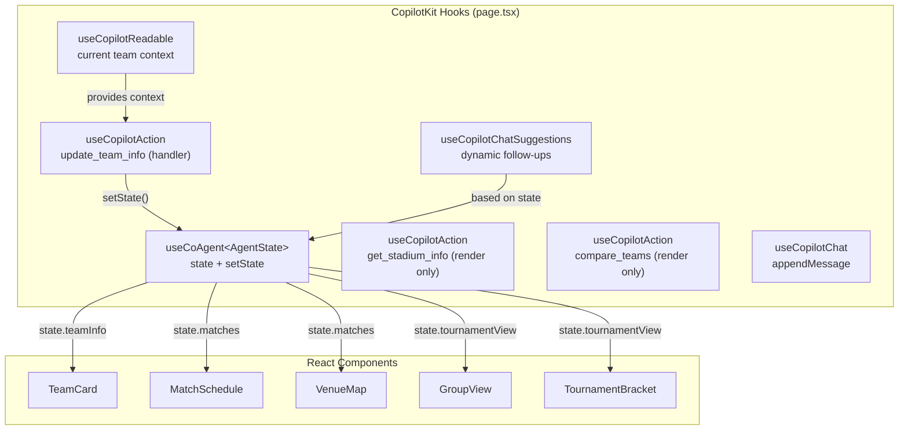
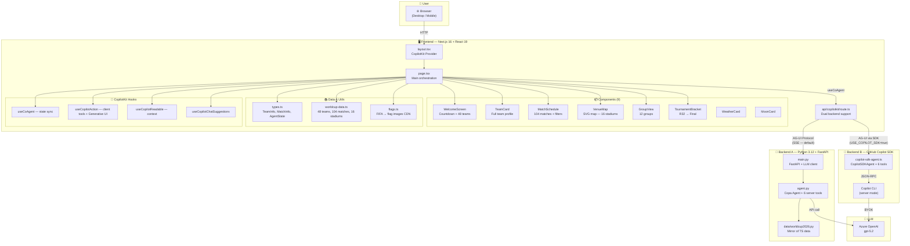
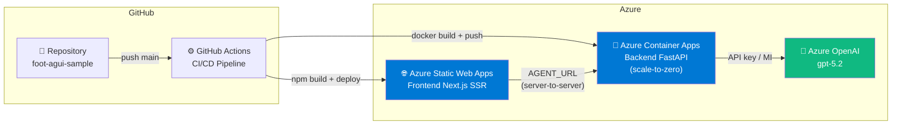
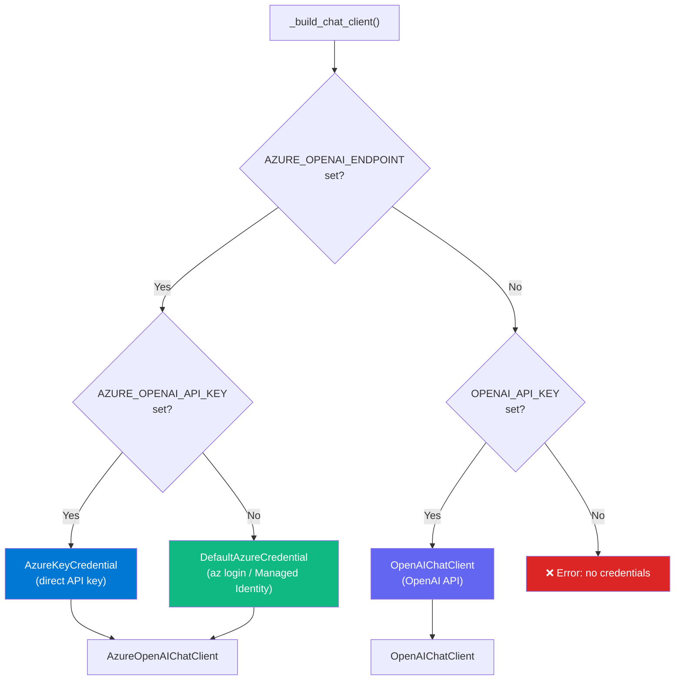
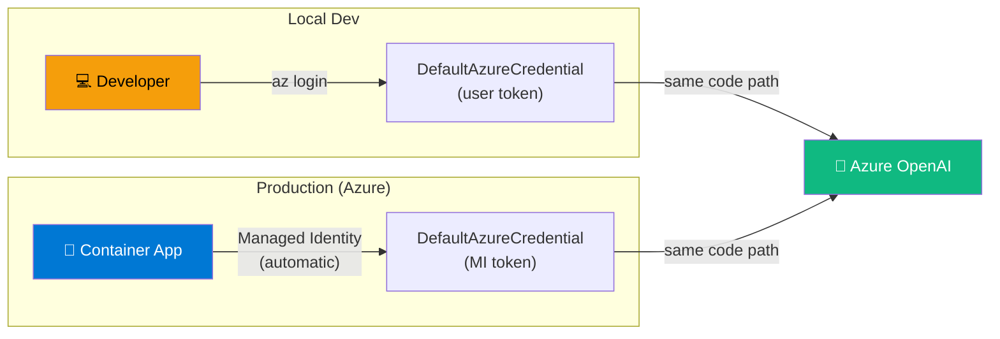

# ⚽🏆 Copa — FIFA World Cup 2026 AI Assistant

> Immersive AI-powered experience to explore the 2026 FIFA World Cup: 48 teams, 104 matches, 16 stadiums — built on the **AG-UI Protocol** with **[GitHub Copilot SDK](https://github.com/github/copilot-sdk)**, **[CopilotKit](https://copilotkit.ai)** and **Microsoft Agent Framework**.
>
> **Dual backend support**: choose between the GitHub Copilot SDK (Node.js, zero Python) or Microsoft Agent Framework (Python/FastAPI).




---

## 🎯 What Copa Can Do

Copa is a **conversational AI assistant** that transforms the FIFA World Cup 2026 into an interactive, dynamic experience. The entire page adapts in real time as you talk to the agent:

| Ask Copa… | What happens |
|---|---|
| 🗣️ *"Show me France"* | The full page switches to France: 🇫🇷 blue theme, team card, match schedule, stadiums on the map |
| ⚔️ *"Compare Brazil vs Argentina"* | Side-by-side rich comparison card rendered **inside the chat** (Generative UI) |
| 🏟️ *"Tell me about MetLife Stadium"* | Interactive stadium card with capacity, city, description — rendered in chat |
| 🌍 *"Show Group C standings"* | Group view with all 4 teams, clickable for navigation |
| 🏆 *"Show the tournament bracket"* | Full R32 → Final bracket view with phase selection |
| 🌤️ *"Weather in Houston?"* | Live weather card for host city |
| 🌙 *"Moon phase on June 11?"* | Fun moon phase card for match day (human-in-the-loop confirmation) |
| 🏙️ *"City guide for Miami"* | Fun facts, food, and transport tips for host city |
| 🔄 *"Now show me Germany"* | Page instantly switches — green theme, new team card, new matches |

The agent suggests follow-up questions dynamically based on what you're viewing — opponents to compare, stadiums to explore, groups to check.

---

## 🧩 AG-UI Protocol — Features Used

This project is a comprehensive implementation of the [AG-UI Protocol](https://docs.ag-ui.com/introduction) (Agent-Generated User Interface). AG-UI enables agents to drive rich, interactive frontends via Server-Sent Events (SSE).

| AG-UI Feature | Status | How We Use It |
|---|---|---|
| **Lifecycle Events** | ✅ Used | `RUN_STARTED`, `RUN_FINISHED`, `RUN_ERROR` — manage agent run lifecycle |
| **Text Message Streaming** | ✅ Used | `TEXT_MESSAGE_START/CONTENT/END` — Copa's passionate football commentary streams word by word |
| **Tool Call Events** | ✅ Used | `TOOL_CALL_START/ARGS/END` — 7 tools declared (client + server side) |
| **State Management** | ✅ Used | `STATE_SNAPSHOT` + `STATE_DELTA` events synchronize `AgentState` (team, matches, stadium, tournament view) between Python agent and React |
| **Shared State Schema** | ✅ Used | `STATE_SCHEMA` defines the full `AgentState` shape — validated on both sides |
| **Frontend-Defined Tools** | ✅ Used | `update_team_info` is a **client-side tool** — agent calls it, CopilotKit executes the handler in the browser, React state updates immediately |
| **Server-Defined Tools** | ✅ Used | 6 `@ai_function` tools run on the Python backend: `get_stadium_info`, `get_group_standings`, `get_venue_weather`, `show_tournament_bracket`, `compare_teams`, `get_city_guide` |
| **Custom Events** | ✅ Used | Weather and Moon cards use custom event rendering |
| **SSE Transport** | ✅ Used | All agent↔frontend communication uses Server-Sent Events via `ag-ui-protocol` |

> **Architecture insight**: Client-side and server-side tools **cannot be mixed in the same LLM turn** (causes orphaned `tool_call_id` errors). The system prompt enforces tool isolation via a `TOOL ISOLATION RULE`.

### AG-UI Data Flow



---

## 🛠️ GitHub Copilot SDK (CopilotKit) — Features Used

The frontend uses the full [CopilotKit](https://docs.copilotkit.ai) SDK to build a deeply integrated AI UX:

| CopilotKit Feature | Hook / Component | How We Use It |
|---|---|---|
| **Co-Agent State** | `useCoAgent<AgentState>` | Bidirectional state sync: `teamInfo`, `matches`, `selectedStadium`, `tournamentView`, `highlightedCity` |
| **Frontend Actions** | `useCopilotAction` | `update_team_info` — client-side tool with handler that directly updates React state |
| **Generative UI** | `useCopilotAction` with `render` | Rich in-chat rendering for `get_stadium_info` (stadium card) and `compare_teams` (comparison grid) |
| **Copilot Readable** | `useCopilotReadable` | Provides current team context to the agent — team name, group, ranking, matches — so it knows what the user is viewing |
| **Chat Suggestions** | `useCopilotChatSuggestions` | Dynamic follow-up prompts based on current state: compare with opponent, check group standings, switch to another team |
| **Chat Management** | `useCopilotChat` | Programmatic message injection: click opponent flag → `appendMessage("Compare X vs Y")` |
| **Message Context** | `useCopilotMessagesContext` | Access full conversation history for text-based team detection fallback |
| **Sidebar UI** | `CopilotSidebar` | Desktop: persistent chat sidebar with custom theme colors |
| **Popup UI** | `CopilotPopup` | Mobile: floating chat bubble that adapts to team theme |
| **CSS Theming** | `CopilotKitCSSProperties` | Dynamic `--copilot-kit-primary-color` based on selected team's national colors |
| **Human-in-the-Loop** | Custom confirmation card | Moon phase card asks user confirmation before rendering |

### CopilotKit Integration Architecture



---

## 🔌 GitHub Copilot SDK — Alternative Backend

The project integrates the official **[GitHub Copilot SDK](https://github.com/github/copilot-sdk)** (`@github/copilot-sdk`) as an alternative backend engine. This allows running Copa **without the Python backend** — everything runs in Node.js.

### How it works

A custom `CopilotSDKAgent` class (in `src/lib/copilot-sdk-agent.ts`) extends AG-UI's `AbstractAgent` and translates **Copilot SDK events → AG-UI events**:

```
Copilot SDK Event              →  AG-UI Event
─────────────────────────────────────────────────
assistant.message.delta        →  TEXT_MESSAGE_CONTENT
tool.invocation.start          →  TOOL_CALL_START + TOOL_CALL_ARGS
tool.invocation.result         →  TOOL_CALL_END
session.idle                   →  TEXT_MESSAGE_END + RUN_FINISHED
error                          →  RUN_ERROR
```

### Enabling Copilot SDK backend

```bash
# 1. Install Copilot CLI (required)
# See: https://docs.github.com/en/copilot/how-tos/set-up/install-copilot-cli

# 2. Set environment variable
echo "USE_COPILOT_SDK=true" >> .env.local

# 3. Configure BYOK (use your existing Azure OpenAI or OpenAI key)
echo "AZURE_OPENAI_ENDPOINT=https://your-resource.openai.azure.com/" >> .env.local
echo "AZURE_OPENAI_API_KEY=your-key" >> .env.local
echo "COPILOT_SDK_MODEL=gpt-4o-mini" >> .env.local

# 4. Run — no Python backend needed!
npm run dev:ui
```

### Copilot SDK features used

| Feature | How We Use It |
|---|---|
| **Custom Tools** | 6 WC2026 tools defined via `defineTool()` — stadiums, groups, weather, bracket, compare, city guide |
| **Custom Agents** | Copa persona with full system prompt |
| **BYOK** | Bring Your Own Key — Azure OpenAI or OpenAI API |
| **Streaming** | Real-time event streaming translated to AG-UI protocol |
| **Tool Invocation** | Automatic tool calling with JSON schema parameters |

---

## 🏗️ Architecture — Dual Backend

The project supports **two backend engines** — configurable via `USE_COPILOT_SDK` env var:

| Backend | Engine | LLM Access | Python Required |
|---|---|---|---|
| **Default** | Microsoft Agent Framework (Python/FastAPI) | Azure OpenAI / OpenAI directly | ✅ Yes |
| **Copilot SDK** | GitHub Copilot SDK (Node.js) | BYOK via Copilot CLI | ❌ No |



### Azure Deployment Architecture



---

## ✨ Key Features

| Feature | Description |
|---|---|
| 🗣️ **Copa Agent** | WC2026 expert chatbot — passionate commentator persona, 7 AI tools (client + server) |
| 🏳️ **48 national teams** | Full profiles: real flag images, key players, honors, FIFA ranking, national colors |
| 📅 **104 matches** | Complete schedule: group stage (72) → R32 (16) → R16 (8) → QF (4) → SF (2) → 3rd place → Final |
| 🗺️ **Interactive SVG map** | 16 stadiums across USA / Canada / Mexico with clickable pins |
| 🌍 **12 groups** | Responsive group view (A→L) with inter-team navigation |
| 🏆 **Tournament bracket** | Visual tree R32 → Final with phase selection |
| 🎨 **Fully dynamic theme** | Entire UI changes colors based on the selected team's national colors |
| 💬 **Generative UI** | Rich cards rendered inside the chat (stadiums, comparisons) |
| 💡 **Smart suggestions** | AI-driven follow-up questions based on current context |
| 📱 **Mobile-first** | Mobile tabs + CopilotPopup / Desktop sidebar + multi-panel grid |
| ⏱️ **Live countdown** | Real-time countdown to June 11, 2026 |
| 🔗 **Cross-component** | Click match → highlight stadium on map; click opponent → comparison in chat |

---

## 🚀 Quick Start

### Prerequisites

| Tool | Version | Install |
|---|---|---|
| Node.js | 18+ (v24 LTS recommended) | [nodejs.org](https://nodejs.org) |
| Python | 3.12+ | [python.org](https://python.org) |
| uv | latest | `pip install uv` |
| API Key | Azure OpenAI or OpenAI | See Configuration below |
| Azure CLI | latest (for `az login` auth) | `winget install Microsoft.AzureCLI` |

### 1. Clone & install

```bash
git clone https://github.com/fredgis/foot-agui-sample.git
cd foot-agui-sample
git checkout worldcup2026

# Frontend
npm install

# Backend
cd agent
uv sync
cd ..
```

### 2. ⚙️ Configure LLM authentication

```bash
cp agent/.env.example agent/.env
```

Edit `agent/.env` with **one** of these options:

#### Option A — Azure OpenAI with API key

```env
AZURE_OPENAI_ENDPOINT=https://your-resource.openai.azure.com/
AZURE_OPENAI_API_KEY=your-api-key
AZURE_OPENAI_CHAT_DEPLOYMENT_NAME=gpt-4o-mini
```

> Direct key auth — no `az login` needed.

#### Option B — Azure OpenAI with `az login` (no key needed) ✅ recommended

```env
AZURE_OPENAI_ENDPOINT=https://your-resource.openai.azure.com/
AZURE_OPENAI_CHAT_DEPLOYMENT_NAME=gpt-4o-mini
```

Then authenticate:

```bash
az login
```

The code uses `DefaultAzureCredential` which picks up your `az login` session automatically.

> ⚠️ **Required IAM role**: your Azure AD account must have **"Cognitive Services OpenAI User"** (or Contributor) on the Azure OpenAI resource. If you get 403 errors, add the role:
>
> Azure Portal → your OpenAI resource → **Access control (IAM)** → **Add role assignment** → "Cognitive Services OpenAI User" → assign to your account.

#### Option C — OpenAI directly

```env
OPENAI_API_KEY=sk-proj-...your-key...
OPENAI_CHAT_MODEL_ID=gpt-4o-mini
```

#### How authentication works (`agent/src/main.py`)



### 3. Run

```bash
# Frontend + Agent together (default: Python backend)
npm run dev

# Or separately:
npm run dev:ui    # → http://localhost:3000
npm run dev:agent # → http://localhost:8000

# Or with GitHub Copilot SDK backend (no Python needed):
USE_COPILOT_SDK=true npm run dev:ui
```

### 4. Test

Open **http://localhost:3000**:

- 🏳️ Click a team flag → the page transforms with national colors and full team profile
- 💬 Type: *"Show me France's matches"*
- ⚔️ Try: *"Compare Brazil vs Argentina"* → rich comparison card in chat
- 🏟️ Ask: *"Tell me about MetLife Stadium"* → interactive stadium card in chat
- 🌍 Navigate between Groups and Bracket views
- 💡 Click suggested follow-up questions to explore more

---

## 📁 Project Structure

```
foot-agui-sample/
├── src/
│   ├── app/
│   │   ├── page.tsx                    # Main orchestration — all CopilotKit hooks + components
│   │   ├── globals.css                 # Dark theme, 8 animations, CopilotKit styles
│   │   ├── layout.tsx                  # CopilotKit Provider + metadata
│   │   └── api/copilotkit/route.ts     # Next.js API → HttpAgent(AGENT_URL) → backend
│   ├── components/
│   │   ├── team-card.tsx               # Team profile (players, honors, confederation, SVG jersey)
│   │   ├── match-schedule.tsx          # 104 matches with phase/group filters + countdown
│   │   ├── venue-map.tsx               # Interactive SVG map — 16 stadiums across 3 countries
│   │   ├── group-view.tsx              # 12 groups (A→L) responsive grid
│   │   ├── tournament-bracket.tsx      # Bracket R32 → Final with phase selection
│   │   ├── weather.tsx                 # Weather card for host cities
│   │   └── moon.tsx                    # Moon phase card (human-in-the-loop)
│   └── lib/
│       ├── types.ts                    # Types: TeamInfo, MatchInfo, StadiumInfo, AgentState
│       ├── worldcup-data.ts            # 48 teams, 16 stadiums, 12 groups, 104 matches
│       ├── flags.ts                    # FIFA code → ISO → flagcdn.com images
│       └── copilot-sdk-agent.ts        # CopilotSDKAgent — AG-UI ↔ GitHub Copilot SDK bridge
├── agent/
│   ├── src/
│   │   ├── agent.py                    # Copa agent: system prompt + 6 server @ai_function tools
│   │   ├── main.py                     # FastAPI + _build_chat_client() (Azure/OpenAI)
│   │   └── data/worldcup2026.py        # Python mirror of TS data
│   ├── .env.example                    # LLM config template — COPY to .env
│   ├── Dockerfile                      # Multi-stage Docker build
│   └── pyproject.toml                  # Python deps (agent-framework-ag-ui)
├── scripts/
│   ├── deploy.sh                       # One-click Azure deploy — idempotent (Linux/Mac)
│   ├── deploy.ps1                      # One-click Azure deploy — idempotent (Windows)
│   └── deploy-config.env.example       # Azure config (subscription, region, resource group)
├── .github/workflows/
│   └── deploy-azure.yml                # CI/CD GitHub Actions → Azure SWA + Container Apps
├── docs/
│   └── worldcup2026-development-plan.md  # Full development plan (1760+ lines, 9 workstreams)
├── package.json
└── README.md                           # ← You are here
```

---

## 🤖 Copa Agent — 7 AI Tools

The Copa agent is defined in `agent/src/agent.py` with a passionate commentator system prompt. Tools are split between **client-side** (executed in the browser) and **server-side** (executed in the Python backend):

### Client-Side Tool (via `useCopilotAction`)

| Tool | Description | UI Effect |
|---|---|---|
| `update_team_info` | Load a national team — called as a **frontend action** | Updates React state → renders TeamCard, changes theme colors, populates MatchSchedule + VenueMap |

### Server-Side Tools (via `@ai_function`)

| Tool | Description | UI Effect |
|---|---|---|
| `get_stadium_info` | Stadium details (capacity, city, description) | Generative UI: rich stadium card in chat |
| `get_group_standings` | Group standings with team details | Switches to GroupView |
| `get_venue_weather` | Host city weather forecast | Renders WeatherCard component |
| `show_tournament_bracket` | Activate bracket view | Switches to TournamentBracket |
| `compare_teams` | Compare two teams head-to-head | Generative UI: side-by-side comparison grid in chat |
| `get_city_guide` | Host city fun facts & travel tips | Text response in chat |

### Shared State (AgentState)

```typescript
type AgentState = {
  teamInfo: TeamInfo | null;           // Selected team → TeamCard
  matches: MatchInfo[];                // Filtered matches → MatchSchedule + VenueMap
  selectedStadium: StadiumInfo | null; // Selected stadium → VenueMap highlight
  tournamentView: "group" | "bracket" | null; // Active view mode
  highlightedCity: string | null;      // Highlighted city on map
};
```

State is synchronized in real time between the Python agent (`STATE_SCHEMA`) and React (`useCoAgent`) via AG-UI `STATE_SNAPSHOT` events.

---

## 🛠️ Available Scripts

| Command | Description |
|---|---|
| `npm run dev` | Start frontend + agent together (concurrently) |
| `npm run dev:ui` | Frontend only (Next.js Turbopack) on `:3000` |
| `npm run dev:agent` | Python agent only on `:8000` |
| `npm run build` | Production build (Next.js) |
| `npm run lint` | ESLint check |

---

## 🎨 Everything is Dynamic

- **Colors** — When a team is selected, the entire UI changes: header, borders, sidebar, countdown, buttons, background gradient, CopilotKit theme
- **Content** — The LLM agent generates responses via real-time AG-UI streaming (SSE events)
- **State sync** — `AgentState` is synchronized between Python and React via `useCoAgent` + `STATE_SNAPSHOT`
- **Generative UI** — Stadium cards and comparison grids are rendered as rich React components inside the chat conversation
- **Smart suggestions** — `useCopilotChatSuggestions` generates contextual follow-up prompts based on the currently viewed team
- **Agent context** — `useCopilotReadable` feeds the agent live information about what the user is viewing
- **UI routing** — Dynamic rendering: WelcomeScreen → TeamCard+Schedule+Map → GroupView → Bracket
- **Flags** — Real flag images loaded from CDN (flagcdn.com)
- **Cross-component** — Click match → highlight stadium; click opponent → comparison in chat; click group team → navigate

---

## ☁️ Azure Deployment

| Component | Azure Service | Notes |
|---|---|---|
| Frontend (SSR) | Azure Static Web Apps | Next.js hybrid rendering, API routes included |
| Backend (API) | Azure Container Apps | Scale-to-zero, Docker, health check at `/healthz` |
| LLM | Azure OpenAI | Managed Identity (zero secrets) |

### Authentication in production: Managed Identity

In production, **no API keys are needed**. The Container App authenticates to Azure OpenAI using its **System-Assigned Managed Identity** — zero secrets, zero rotation.



#### Setup steps for production

```bash
# 1. Enable System-Assigned Managed Identity on your Container App
az containerapp identity assign \
  --name <your-container-app> \
  --resource-group <your-rg> \
  --system-assigned

# 2. Get the Managed Identity's principal ID
PRINCIPAL_ID=$(az containerapp show \
  --name <your-container-app> \
  --resource-group <your-rg> \
  --query identity.principalId -o tsv)

# 3. Get your Azure OpenAI resource ID
OPENAI_ID=$(az cognitiveservices account show \
  --name <your-openai-resource> \
  --resource-group <your-rg> \
  --query id -o tsv)

# 4. Assign the "Cognitive Services OpenAI User" role
az role assignment create \
  --role "Cognitive Services OpenAI User" \
  --assignee $PRINCIPAL_ID \
  --scope $OPENAI_ID
```

That's it. The Container App's `DefaultAzureCredential()` automatically picks up the Managed Identity token. **No `AZURE_OPENAI_API_KEY` env var needed in production.**

> The same Python code works in both dev (`az login` token) and prod (Managed Identity token) — `DefaultAzureCredential` handles both transparently.

### One-click deploy (idempotent)

```bash
cp scripts/deploy-config.env.example scripts/deploy-config.env
# Edit with your Azure values

# Linux/Mac
bash scripts/deploy.sh

# Windows
powershell scripts/deploy.ps1
```

The script is **re-entrant**: it can be re-run at any time without breaking existing resources (7 idempotent steps).

### CI/CD with GitHub Actions

The workflow `.github/workflows/deploy-azure.yml` triggers on push to `main`.

Required GitHub secrets:

| Secret | Description |
|---|---|
| `AZURE_CREDENTIALS` | Service Principal JSON |
| `AZURE_STATIC_WEB_APPS_API_TOKEN` | SWA deployment token |
| `AGENT_URL` | Container App backend URL |

> ⚠️ `AGENT_URL` must also be set as an **Application Setting** in the Azure SWA portal for runtime SSR to work.

---

## 🔧 Tech Stack

| Layer | Technology | Version |
|---|---|---|
| Frontend | Next.js + React + TailwindCSS | 16 + 19 + 4 |
| Chat UI | CopilotKit (Sidebar + Popup) | 1.52.1 |
| Protocol | AG-UI (SSE events) | 0.0.46 |
| Backend A | Python + FastAPI + Microsoft Agent Framework | 3.12 |
| Backend B | GitHub Copilot SDK (Node.js) | latest |
| LLM | Azure OpenAI / OpenAI | gpt-5.2 / gpt-4o-mini |
| Deployment | Azure Static Web Apps + Container Apps | — |
| CI/CD | GitHub Actions | — |
| Flags | flagcdn.com (CDN) | — |

---

## 📚 Additional Documentation

| Document | Content |
|---|---|
| [`docs/worldcup2026-development-plan.md`](docs/worldcup2026-development-plan.md) | Full development plan: 9 workstreams, Mermaid diagrams, acceptance criteria, risks, detailed architecture |
| [`ARCHITECTURE.md`](ARCHITECTURE.md) | Original technical architecture (club mode) |
| [`DEBUG.md`](DEBUG.md) | Debugging guide |

---

## 📊 Development Stats

| Metric | Value |
|---|---|
| **Development period** | January 8 → February 28, 2026 (~52 days) |
| **Total commits** | 73 (72 on `worldcup2026` branch) |
| **Copilot-assisted commits** | 50 (68% of all commits) |
| **Lines of code** | ~7,200 (TypeScript: 5,000 · Python: 1,900 · CSS: 300) |
| **React components** | 9 |
| **AI tools** | 7 (1 client-side + 6 server-side) |
| **WC2026 data** | 48 teams · 104 matches · 16 stadiums · 12 groups |
| **Development plan** | 1,760+ lines across 9 workstreams |
| **Agent framework** | GitHub Copilot CLI (Copilot Agent) used throughout for code, architecture, and debugging |

> 🤖 This project was developed collaboratively with **GitHub Copilot Agent** — from initial planning and issue creation through architecture decisions, implementation, debugging, and documentation. The agent handled complex AG-UI protocol debugging, tool pipeline fixes, and full-stack TypeScript/Python development.

---

## 📄 License

MIT — see [LICENSE](LICENSE)

---

**⚽ Built for the 2026 FIFA World Cup 🇺🇸🇲🇽🇨🇦**
**Powered by [AG-UI Protocol](https://docs.ag-ui.com) · [GitHub Copilot SDK](https://github.com/github/copilot-sdk) · [CopilotKit](https://copilotkit.ai) · [Microsoft Agent Framework](https://aka.ms/agent-framework) · [Azure OpenAI](https://azure.microsoft.com/products/ai-services/openai-service)**
