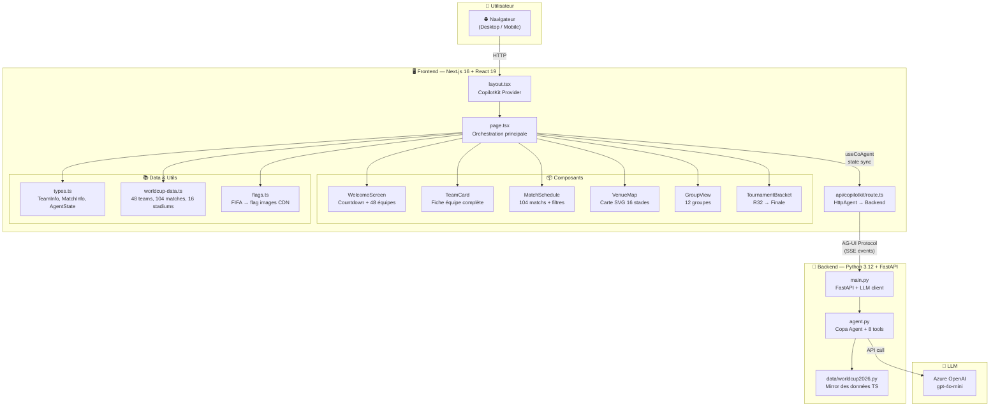
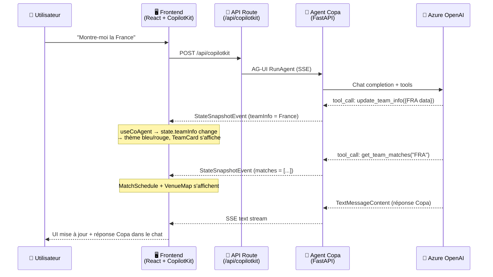

# ⚽🏆 FIFA World Cup 2026 — Copa, Assistant IA Immersif

> Application conversationnelle propulsée par l'IA pour explorer la Coupe du Monde 2026 : 48 équipes, 104 matchs, 16 stades — powered by AG-UI + CopilotKit + Microsoft Agent Framework.

---

## 🌟 Présentation

**Copa** est un assistant IA expert de la **Coupe du Monde FIFA 2026** 🇺🇸🇲🇽🇨🇦.

L'application combine un **agent conversationnel intelligent** (Python + Microsoft Agent Framework) avec une **interface immersive** (Next.js + React 19) qui s'adapte dynamiquement à chaque équipe sélectionnée — couleurs nationales, drapeaux, calendrier des matchs, carte des stades, groupes et bracket du tournoi.

Le protocole **AG-UI** (Agent-Generated UI) permet au backend de piloter l'interface en temps réel via des événements SSE, avec synchronisation bidirectionnelle du state entre l'agent Python et les composants React.

### ✨ Fonctionnalités principales

| Fonctionnalité | Description |
|---|---|
| 🗣️ **Agent Copa** | Chatbot expert WC2026 avec 8 outils IA (infos équipes, matchs, stades, comparaisons, météo, bracket, guide ville) |
| 🏳️ **48 équipes** | Fiches complètes avec drapeaux réels, joueurs clés, palmarès, classement FIFA, couleurs nationales |
| 📅 **104 matchs** | Calendrier complet : phases de groupes (72) → R32 (16) → R16 (8) → QF (4) → SF (2) → 3e place → Finale |
| 🗺️ **Carte SVG interactive** | 16 stades placés sur carte USA / Canada / Mexique avec pins cliquables |
| 🌍 **12 groupes** | Vue groupes responsive avec navigation inter-équipes |
| 🏆 **Bracket tournoi** | Arbre visuel R32 → Finale avec sélection de phase |
| 🎨 **Thème 100% dynamique** | L'UI entière change de couleurs selon l'équipe sélectionnée |
| 📱 **Mobile-first** | Tabs mobiles + CopilotPopup / Desktop sidebar + grille multi-panneaux |
| ⏱️ **Countdown live** | Décompte en temps réel jusqu'au 11 juin 2026 |
| 🔗 **Cross-component** | Clic match → highlight stade sur carte ; clic adversaire → comparaison dans le chat |

---

## 🏗️ Architecture globale



### Flux de données détaillé



### Architecture de déploiement Azure


---

## 🚀 Démarrage rapide

### Prérequis

| Outil | Version | Installation |
|---|---|---|
| Node.js | 18+ (v24 LTS recommandé) | [nodejs.org](https://nodejs.org) |
| Python | 3.12+ | [python.org](https://python.org) |
| uv | latest | `pip install uv` |
| Clé API | Azure OpenAI ou OpenAI | Voir section Configuration |

### 1. Cloner et installer

```bash
git clone https://github.com/fredgis/foot-agui-sample.git
cd foot-agui-sample
git checkout worldcup2026

# Frontend
npm install

# Backend
cd agent
uv sync
cd ..
```

### 2. ⚙️ Configurer la clé du modèle LLM

```bash
cp agent/.env.example agent/.env
```

Éditer `agent/.env` avec **une** de ces options :

#### Option A — Azure OpenAI avec clé API ✅ (recommandé)

```env
AZURE_OPENAI_ENDPOINT=https://votre-resource.openai.azure.com/
AZURE_OPENAI_API_KEY=votre-clé-api
AZURE_OPENAI_CHAT_DEPLOYMENT_NAME=gpt-4o-mini
```

> Pas de `az login` nécessaire — la clé API suffit.

#### Option B — Azure OpenAI avec Managed Identity

```env
AZURE_OPENAI_ENDPOINT=https://votre-resource.openai.azure.com/
AZURE_OPENAI_CHAT_DEPLOYMENT_NAME=gpt-4o-mini
```

> Sans clé API, le code utilise `DefaultAzureCredential` (nécessite `az login` en local, Managed Identity en prod).

#### Option C — OpenAI directement

```env
OPENAI_API_KEY=sk-proj-...votre-clé...
OPENAI_CHAT_MODEL_ID=gpt-4o-mini
```

### 3. Lancer

```bash
# Frontend + Agent ensemble
npm run dev

# Ou séparément :
npm run dev:ui    # → http://localhost:3000
npm run dev:agent # → http://localhost:8000
```

### 4. Tester

Ouvrir **http://localhost:3000** :

- 🏳️ Cliquer sur un drapeau → l'agent affiche la fiche complète de l'équipe
- 💬 Taper : *"Montre-moi les matchs de la France"*
- ⚔️ Essayer : *"Compare Brésil vs Argentine"*
- 🏟️ Demander : *"Parle-moi du MetLife Stadium"*
- 🌍 Naviguer entre Groupes et Bracket

---

## 📁 Structure du projet

```
foot-agui-sample/
├── src/
│   ├── app/
│   │   ├── page.tsx                    # Orchestration — WelcomeScreen, routing, cross-component
│   │   ├── globals.css                 # Dark theme, 8 animations, CopilotKit styles
│   │   ├── layout.tsx                  # CopilotKit Provider + metadata
│   │   └── api/copilotkit/route.ts     # Next.js API → HttpAgent(AGENT_URL) → backend
│   ├── components/
│   │   ├── team-card.tsx               # Fiche équipe (joueurs, palmarès, confédération, maillot SVG)
│   │   ├── match-schedule.tsx          # 104 matchs avec filtres phase/groupe + countdown
│   │   ├── venue-map.tsx               # Carte SVG interactive — 16 stades sur 3 pays
│   │   ├── group-view.tsx              # 12 groupes (A→L) responsive grid
│   │   └── tournament-bracket.tsx      # Bracket R32 → Finale avec sélection de phase
│   └── lib/
│       ├── types.ts                    # Types : TeamInfo, MatchInfo, StadiumInfo, AgentState
│       ├── worldcup-data.ts            # 48 teams, 16 stadiums, 12 groups, 104 matches
│       └── flags.ts                    # FIFA code → ISO → flagcdn.com images
├── agent/
│   ├── src/
│   │   ├── agent.py                    # Copa agent : system prompt + 8 @ai_function tools
│   │   ├── main.py                     # FastAPI + _build_chat_client() (Azure/OpenAI)
│   │   └── data/worldcup2026.py        # Mirror Python des données TS
│   ├── .env.example                    # Template config LLM — COPIER vers .env
│   ├── Dockerfile                      # Multi-stage Docker build
│   └── pyproject.toml                  # Dépendances Python (agent-framework-ag-ui)
├── scripts/
│   ├── deploy.sh                       # One-click Azure deploy — idempotent (Linux/Mac)
│   ├── deploy.ps1                      # One-click Azure deploy — idempotent (Windows)
│   └── deploy-config.env.example       # Config Azure (subscription, region, resource group)
├── .github/workflows/
│   └── deploy-azure.yml                # CI/CD GitHub Actions → Azure SWA + Container Apps
├── docs/
│   └── worldcup2026-development-plan.md  # Plan de développement complet (1470+ lignes, 9 workstreams)
├── package.json
└── README.md                           # ← Vous êtes ici
```

---

## 🤖 Agent Copa — 8 outils IA

L'agent Copa est défini dans `agent/src/agent.py` avec un system prompt de commentateur passionné et 8 fonctions IA :

| Outil | Description | Effet sur l'UI |
|---|---|---|
| `update_team_info` | Charge une équipe dans le state | Affiche TeamCard, change les couleurs |
| `get_team_matches` | Retourne les matchs d'une équipe | Affiche MatchSchedule + VenueMap |
| `get_stadium_info` | Détails d'un stade | Highlight sur la carte, info bulle |
| `get_group_standings` | Classement d'un groupe | Bascule en GroupView |
| `get_venue_weather` | Météo d'une ville hôte | Affiche WeatherCard |
| `show_tournament_bracket` | Active la vue bracket | Bascule en TournamentBracket |
| `compare_teams` | Compare deux équipes | Affiche les deux fiches |
| `get_city_guide` | Anecdotes sur une ville hôte | Texte dans le chat |

### State partagé (AgentState)

```typescript
type AgentState = {
  teamInfo: TeamInfo | null;        // Équipe sélectionnée → TeamCard
  matches: MatchInfo[];             // Matchs filtrés → MatchSchedule
  selectedStadium: StadiumInfo | null; // Stade sélectionné → VenueMap highlight
  tournamentView: "group" | "bracket" | null; // Vue active
  highlightedCity: string | null;   // Ville highlight sur la carte
};
```

Ce state est synchronisé en temps réel entre Python (`predict_state` + `STATE_SCHEMA`) et React (`useCoAgent`).

---

## 🛠️ Scripts disponibles

| Commande | Description |
|---|---|
| `npm run dev` | Lance frontend + agent ensemble (concurrently) |
| `npm run dev:ui` | Frontend seul (Next.js Turbopack) sur `:3000` |
| `npm run dev:agent` | Agent Python seul sur `:8000` |
| `npm run build` | Build de production Next.js |
| `npm run lint` | Vérification ESLint |

---

## 🎨 Tout est dynamique

- **Couleurs** — Quand une équipe est sélectionnée, l'UI entière change : header, borders, sidebar, countdown, boutons, background gradient
- **Contenu** — L'agent LLM génère les réponses en streaming temps réel via AG-UI (SSE events)
- **State sync** — Le state Python (`teamInfo`, `matches`, `selectedStadium`, `tournamentView`, `highlightedCity`) est synchronisé avec React via `useCoAgent` / `predict_state`
- **Routing UI** — La page affiche dynamiquement le bon composant : WelcomeScreen → TeamCard+Schedule+Map → GroupView → Bracket
- **Drapeaux** — Images chargées à la demande depuis CDN (flagcdn.com)
- **Cross-component** — Clic match → highlight stade ; clic adversaire → comparaison chat ; clic groupe → navigation équipe

---

## ☁️ Déploiement Azure

| Composant | Service Azure | Notes |
|---|---|---|
| Frontend (SSR) | Azure Static Web Apps | Next.js hybrid rendering, API routes incluses |
| Backend (API) | Azure Container Apps | Scale-to-zero, Docker, health check `/healthz` |
| LLM | Azure OpenAI | API key ou Managed Identity |

### One-click deploy (idempotent)

```bash
cp scripts/deploy-config.env.example scripts/deploy-config.env
# Éditer avec vos valeurs Azure

# Linux/Mac
bash scripts/deploy.sh

# Windows
powershell scripts/deploy.ps1
```

Le script est **réentrant** : il peut être relancé à tout moment sans casser l'existant (7 étapes idempotentes).

### CI/CD GitHub Actions

Le workflow `.github/workflows/deploy-azure.yml` se déclenche sur push vers `main`.

Secrets GitHub requis :

| Secret | Description |
|---|---|
| `AZURE_CREDENTIALS` | Service Principal JSON |
| `AZURE_STATIC_WEB_APPS_API_TOKEN` | Token déploiement SWA |
| `AGENT_URL` | URL du Container App backend |

> ⚠️ `AGENT_URL` doit aussi être configuré comme **Application Setting** dans le portail Azure SWA pour fonctionner au runtime SSR.

---

## 📚 Documentation complémentaire

| Document | Contenu |
|---|---|
| [`docs/worldcup2026-development-plan.md`](docs/worldcup2026-development-plan.md) | Plan de développement complet : 9 workstreams, diagrammes Mermaid, acceptance criteria, risques, architecture détaillée |
| [`ARCHITECTURE.md`](ARCHITECTURE.md) | Architecture technique originale |
| [`DEBUG.md`](DEBUG.md) | Guide de débogage |

---

## 🔧 Stack technique

| Couche | Technologie | Version |
|---|---|---|
| Frontend | Next.js + React + TailwindCSS | 16 + 19 + 4 |
| Chat UI | CopilotKit (Sidebar + Popup) | 1.52.1 |
| Protocol | AG-UI (SSE events) | 0.0.46 |
| Backend | Python + FastAPI + Microsoft Agent Framework | 3.12 |
| LLM | Azure OpenAI / OpenAI | gpt-4o-mini |
| Déploiement | Azure Static Web Apps + Container Apps | — |
| CI/CD | GitHub Actions | — |
| Flags | flagcdn.com (CDN) | — |

---

## 📄 Licence

MIT — voir [LICENSE](LICENSE)

---

**⚽ Développé pour la FIFA World Cup 2026 🇺🇸🇲🇽🇨🇦**
**Propulsé par [CopilotKit](https://copilotkit.ai) + [Microsoft Agent Framework](https://aka.ms/agent-framework) + [Azure OpenAI](https://azure.microsoft.com/products/ai-services/openai-service)**
