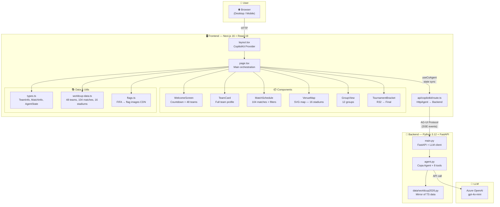
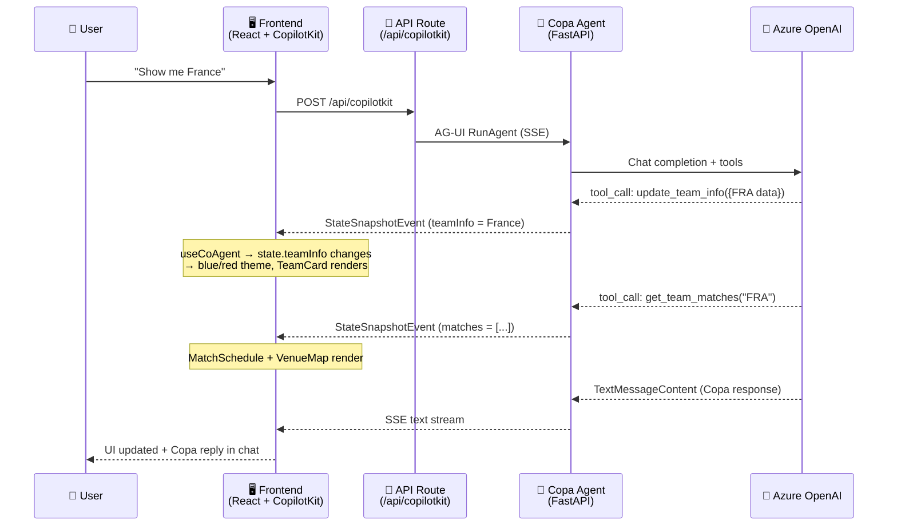

# ⚽🏆 FIFA World Cup 2026 — Copa, Immersive AI Assistant

> AI-powered conversational app to explore the 2026 FIFA World Cup: 48 teams, 104 matches, 16 stadiums — built with AG-UI + CopilotKit + Microsoft Agent Framework.

---

## 🌟 Overview

**Copa** is an AI assistant specialized in the **2026 FIFA World Cup** 🇺🇸🇲🇽🇨🇦.

It combines an **intelligent conversational agent** (Python + Microsoft Agent Framework) with an **immersive UI** (Next.js + React 19) that dynamically adapts to each selected team — national colors, flags, match schedule, stadium map, group standings and tournament bracket.

The **AG-UI** (Agent-Generated UI) protocol lets the backend drive the frontend in real time via SSE events, with bidirectional state synchronization between the Python agent and React components.

### ✨ Key Features

| Feature | Description |
|---|---|
| 🗣️ **Copa Agent** | WC2026 expert chatbot with 8 AI tools (team info, matches, stadiums, comparisons, weather, bracket, city guide) |
| 🏳️ **48 teams** | Full profiles with real flag images, key players, honors, FIFA ranking, national colors |
| 📅 **104 matches** | Complete schedule: group stage (72) → R32 (16) → R16 (8) → QF (4) → SF (2) → 3rd place → Final |
| 🗺️ **Interactive SVG map** | 16 stadiums across USA / Canada / Mexico with clickable pins |
| 🌍 **12 groups** | Responsive group view with inter-team navigation |
| 🏆 **Tournament bracket** | Visual tree R32 → Final with phase selection |
| 🎨 **Fully dynamic theme** | Entire UI changes colors based on the selected team |
| 📱 **Mobile-first** | Mobile tabs + CopilotPopup / Desktop sidebar + multi-panel grid |
| ⏱️ **Live countdown** | Real-time countdown to June 11, 2026 |
| 🔗 **Cross-component** | Click match → highlight stadium on map; click opponent → comparison in chat |

---

## 🏗️ Architecture



### Data Flow



### Azure Deployment Architecture


---

## 🚀 Quick Start

### Prerequisites

| Tool | Version | Install |
|---|---|---|
| Node.js | 18+ (v24 LTS recommended) | [nodejs.org](https://nodejs.org) |
| Python | 3.12+ | [python.org](https://python.org) |
| uv | latest | `pip install uv` |
| API Key | Azure OpenAI or OpenAI | See Configuration below |

### 1. Clone & install

```bash
git clone https://github.com/fredgis/foot-agui-sample.git
cd foot-agui-sample
git checkout worldcup2026

# Frontend
npm install

# Backend
cd agent
uv sync
cd ..
```

### 2. ⚙️ Configure the LLM API key

```bash
cp agent/.env.example agent/.env
```

Edit `agent/.env` with **one** of these options:

#### Option A — Azure OpenAI with API key ✅ (recommended)

```env
AZURE_OPENAI_ENDPOINT=https://your-resource.openai.azure.com/
AZURE_OPENAI_API_KEY=your-api-key
AZURE_OPENAI_CHAT_DEPLOYMENT_NAME=gpt-4o-mini
```

> No `az login` needed — the API key is used directly.

#### Option B — Azure OpenAI with Managed Identity

```env
AZURE_OPENAI_ENDPOINT=https://your-resource.openai.azure.com/
AZURE_OPENAI_CHAT_DEPLOYMENT_NAME=gpt-4o-mini
```

> Without `AZURE_OPENAI_API_KEY`, the code uses `DefaultAzureCredential` (requires `az login` locally, Managed Identity in prod).

#### Option C — OpenAI directly

```env
OPENAI_API_KEY=sk-proj-...your-key...
OPENAI_CHAT_MODEL_ID=gpt-4o-mini
```

### 3. Run

```bash
# Frontend + Agent together
npm run dev

# Or separately:
npm run dev:ui    # → http://localhost:3000
npm run dev:agent # → http://localhost:8000
```

### 4. Test

Open **http://localhost:3000**:

- 🏳️ Click a team flag → the agent shows the full team profile
- 💬 Type: *"Show me France's matches"*
- ⚔️ Try: *"Compare Brazil vs Argentina"*
- 🏟️ Ask: *"Tell me about MetLife Stadium"*
- 🌍 Navigate between Groups and Bracket views

---

## 📁 Project Structure

```
foot-agui-sample/
├── src/
│   ├── app/
│   │   ├── page.tsx                    # Orchestration — WelcomeScreen, routing, cross-component
│   │   ├── globals.css                 # Dark theme, 8 animations, CopilotKit styles
│   │   ├── layout.tsx                  # CopilotKit Provider + metadata
│   │   └── api/copilotkit/route.ts     # Next.js API → HttpAgent(AGENT_URL) → backend
│   ├── components/
│   │   ├── team-card.tsx               # Team profile (players, honors, confederation, SVG jersey)
│   │   ├── match-schedule.tsx          # 104 matches with phase/group filters + countdown
│   │   ├── venue-map.tsx               # Interactive SVG map — 16 stadiums across 3 countries
│   │   ├── group-view.tsx              # 12 groups (A→L) responsive grid
│   │   └── tournament-bracket.tsx      # Bracket R32 → Final with phase selection
│   └── lib/
│       ├── types.ts                    # Types: TeamInfo, MatchInfo, StadiumInfo, AgentState
│       ├── worldcup-data.ts            # 48 teams, 16 stadiums, 12 groups, 104 matches
│       └── flags.ts                    # FIFA code → ISO → flagcdn.com images
├── agent/
│   ├── src/
│   │   ├── agent.py                    # Copa agent: system prompt + 8 @ai_function tools
│   │   ├── main.py                     # FastAPI + _build_chat_client() (Azure/OpenAI)
│   │   └── data/worldcup2026.py        # Python mirror of TS data
│   ├── .env.example                    # LLM config template — COPY to .env
│   ├── Dockerfile                      # Multi-stage Docker build
│   └── pyproject.toml                  # Python deps (agent-framework-ag-ui)
├── scripts/
│   ├── deploy.sh                       # One-click Azure deploy — idempotent (Linux/Mac)
│   ├── deploy.ps1                      # One-click Azure deploy — idempotent (Windows)
│   └── deploy-config.env.example       # Azure config (subscription, region, resource group)
├── .github/workflows/
│   └── deploy-azure.yml                # CI/CD GitHub Actions → Azure SWA + Container Apps
├── docs/
│   └── worldcup2026-development-plan.md  # Full development plan (1470+ lines, 9 workstreams)
├── package.json
└── README.md                           # ← You are here
```

---

## 🤖 Copa Agent — 8 AI Tools

The Copa agent is defined in `agent/src/agent.py` with a passionate commentator system prompt and 8 AI functions:

| Tool | Description | UI Effect |
|---|---|---|
| `update_team_info` | Load a team into the shared state | Renders TeamCard, changes theme colors |
| `get_team_matches` | Return a team's group-stage matches | Renders MatchSchedule + VenueMap |
| `get_stadium_info` | Stadium details | Highlights stadium on map |
| `get_group_standings` | Group standings | Switches to GroupView |
| `get_venue_weather` | Host city weather | Renders WeatherCard |
| `show_tournament_bracket` | Activate bracket view | Switches to TournamentBracket |
| `compare_teams` | Compare two teams | Shows both team profiles |
| `get_city_guide` | Host city fun facts | Text response in chat |

### Shared State (AgentState)

```typescript
type AgentState = {
  teamInfo: TeamInfo | null;           // Selected team → TeamCard
  matches: MatchInfo[];                // Filtered matches → MatchSchedule
  selectedStadium: StadiumInfo | null; // Selected stadium → VenueMap highlight
  tournamentView: "group" | "bracket" | null; // Active view
  highlightedCity: string | null;      // Highlighted city on map
};
```

This state is synchronized in real time between Python (`predict_state` + `STATE_SCHEMA`) and React (`useCoAgent`).

---

## 🛠️ Available Scripts

| Command | Description |
|---|---|
| `npm run dev` | Start frontend + agent together (concurrently) |
| `npm run dev:ui` | Frontend only (Next.js Turbopack) on `:3000` |
| `npm run dev:agent` | Python agent only on `:8000` |
| `npm run build` | Production build (Next.js) |
| `npm run lint` | ESLint check |

---

## 🎨 Everything is Dynamic

- **Colors** — When a team is selected, the entire UI changes: header, borders, sidebar, countdown, buttons, background gradient
- **Content** — The LLM agent generates responses via real-time AG-UI streaming (SSE events)
- **State sync** — The Python state (`teamInfo`, `matches`, `selectedStadium`, `tournamentView`, `highlightedCity`) is synchronized with React via `useCoAgent` / `predict_state`
- **UI routing** — The page dynamically renders the right component: WelcomeScreen → TeamCard+Schedule+Map → GroupView → Bracket
- **Flags** — Images loaded on demand from CDN (flagcdn.com)
- **Cross-component** — Click match → highlight stadium; click opponent → comparison in chat; click group team → navigate

---

## ☁️ Azure Deployment

| Component | Azure Service | Notes |
|---|---|---|
| Frontend (SSR) | Azure Static Web Apps | Next.js hybrid rendering, API routes included |
| Backend (API) | Azure Container Apps | Scale-to-zero, Docker, health check at `/healthz` |
| LLM | Azure OpenAI | API key or Managed Identity |

### One-click deploy (idempotent)

```bash
cp scripts/deploy-config.env.example scripts/deploy-config.env
# Edit with your Azure values

# Linux/Mac
bash scripts/deploy.sh

# Windows
powershell scripts/deploy.ps1
```

The script is **re-entrant**: it can be re-run at any time without breaking existing resources (7 idempotent steps).

### CI/CD with GitHub Actions

The workflow `.github/workflows/deploy-azure.yml` triggers on push to `main`.

Required GitHub secrets:

| Secret | Description |
|---|---|
| `AZURE_CREDENTIALS` | Service Principal JSON |
| `AZURE_STATIC_WEB_APPS_API_TOKEN` | SWA deployment token |
| `AGENT_URL` | Container App backend URL |

> ⚠️ `AGENT_URL` must also be set as an **Application Setting** in the Azure SWA portal for runtime SSR to work.

---

## 📚 Additional Documentation

| Document | Content |
|---|---|
| [`docs/worldcup2026-development-plan.md`](docs/worldcup2026-development-plan.md) | Full development plan: 9 workstreams, Mermaid diagrams, acceptance criteria, risks, detailed architecture |
| [`ARCHITECTURE.md`](ARCHITECTURE.md) | Original technical architecture |
| [`DEBUG.md`](DEBUG.md) | Debugging guide |

---

## 🔧 Tech Stack

| Layer | Technology | Version |
|---|---|---|
| Frontend | Next.js + React + TailwindCSS | 16 + 19 + 4 |
| Chat UI | CopilotKit (Sidebar + Popup) | 1.52.1 |
| Protocol | AG-UI (SSE events) | 0.0.46 |
| Backend | Python + FastAPI + Microsoft Agent Framework | 3.12 |
| LLM | Azure OpenAI / OpenAI | gpt-4o-mini |
| Deployment | Azure Static Web Apps + Container Apps | — |
| CI/CD | GitHub Actions | — |
| Flags | flagcdn.com (CDN) | — |

---

## 📄 License

MIT — see [LICENSE](LICENSE)

---

**⚽ Built for the 2026 FIFA World Cup 🇺🇸🇲🇽🇨🇦**
**Powered by [CopilotKit](https://copilotkit.ai) · [Microsoft Agent Framework](https://aka.ms/agent-framework) · [Azure OpenAI](https://azure.microsoft.com/products/ai-services/openai-service)**
