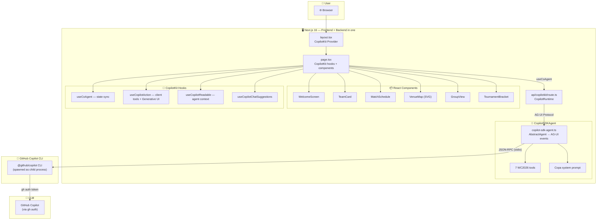
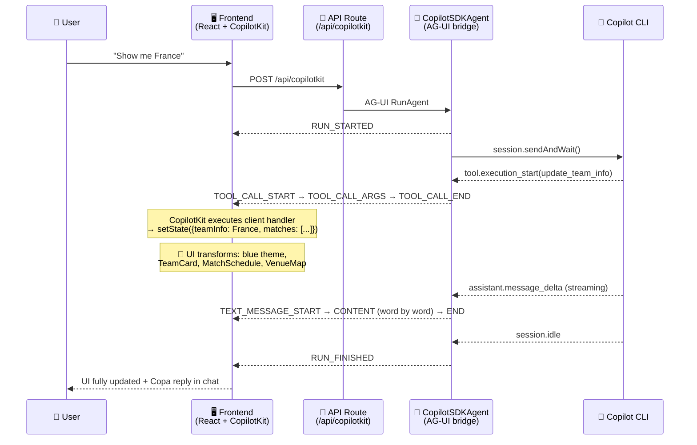
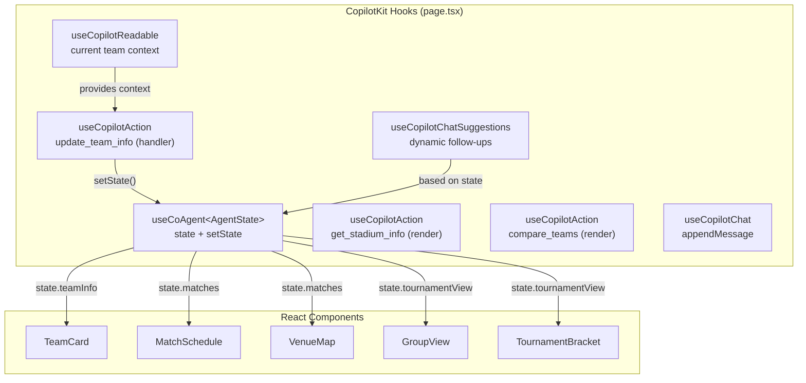

# ⚽🏆 Copa — FIFA World Cup 2026 AI Assistant

> Immersive AI-powered experience to explore the 2026 FIFA World Cup: 48 teams, 104 matches, 16 stadiums — built with the **[AG-UI Protocol](https://docs.ag-ui.com)** and the **[GitHub Copilot SDK](https://github.com/github/copilot-sdk)**.
>
> **Zero Python. Zero separate backend. Everything runs in Node.js.**


---

## 🎯 What Copa Can Do

Copa is a **conversational AI assistant** that transforms the FIFA World Cup 2026 into an interactive, dynamic experience. The entire page adapts in real time as you talk to the agent:

| Ask Copa… | What happens |
|---|---|
| 🗣️ *"Show me France"* | Full page switches to France: 🇫🇷 blue theme, team card, match schedule, stadiums on the map |
| ⚔️ *"Compare Brazil vs Argentina"* | Side-by-side rich comparison card rendered **inside the chat** (Generative UI) |
| 🏟️ *"Tell me about MetLife Stadium"* | Interactive stadium card with capacity, city, description — rendered in chat |
| 🌍 *"Show Group C standings"* | Group view with all 4 teams, clickable for navigation |
| 🏆 *"Show the tournament bracket"* | Full R32 → Final bracket view with phase selection |
| 🌤️ *"Weather in Houston?"* | Live weather card for host city |
| 🌙 *"Moon phase on June 11?"* | Fun moon phase card (human-in-the-loop confirmation) |
| 🏙️ *"City guide for Miami"* | Fun facts, food, and transport tips for host city |
| 🔄 *"Now show me Germany"* | Page instantly switches — green theme, new team card, new matches |

---

## 🏗️ Architecture — AG-UI + GitHub Copilot SDK

The project combines two technologies to deliver a fully integrated AI chat experience:



### Why AG-UI Protocol?

The [AG-UI Protocol](https://docs.ag-ui.com) is an open standard for agent ↔ frontend communication via Server-Sent Events (SSE). It enables:

- **Streaming text** — Copa's commentary streams word-by-word to the user
- **Tool call orchestration** — Agent calls tools, frontend renders results
- **Lifecycle management** — `RUN_STARTED` / `RUN_FINISHED` / `RUN_ERROR` events
- **Frontend-defined tools** — `update_team_info` runs in the browser, not the server

| AG-UI Feature | How Copa Uses It |
|---|---|
| **Lifecycle Events** | `RUN_STARTED`, `RUN_FINISHED`, `RUN_ERROR` — manage agent run lifecycle |
| **Text Message Streaming** | `TEXT_MESSAGE_START/CONTENT/END` — Copa commentary streams in real time |
| **Tool Call Events** | `TOOL_CALL_START/ARGS/END` — 7 tools (1 client-side + 6 server-side) |
| **Frontend-Defined Tools** | `update_team_info` is a **client-side tool** — agent calls it, CopilotKit executes in browser |
| **SSE Transport** | All events flow as Server-Sent Events |

### Why GitHub Copilot SDK?

The [GitHub Copilot SDK](https://github.com/github/copilot-sdk) (`@github/copilot-sdk`) provides a Node.js client for the Copilot CLI. Benefits:

- **Zero API keys** — Uses `gh auth` token, no Azure/OpenAI keys needed
- **Zero Python** — Everything runs in the Next.js process (no separate backend)
- **Custom tools** — Define tools with JSON Schema, model calls them automatically
- **Streaming** — Real-time event streaming translated to AG-UI protocol
- **Simple integration** — Extend `AbstractAgent`, translate events, done

The `CopilotSDKAgent` class (in `src/lib/copilot-sdk-agent.ts`) bridges the two:

```
Copilot SDK Event              →  AG-UI Event
─────────────────────────────────────────────────
assistant.message_delta        →  TEXT_MESSAGE_CONTENT
tool.execution_start           →  TOOL_CALL_START + TOOL_CALL_ARGS
tool.execution_complete        →  TOOL_CALL_END
session.idle                   →  TEXT_MESSAGE_END + RUN_FINISHED
session.error                  →  RUN_ERROR
```

### AG-UI Data Flow



---

## 🛠️ CopilotKit — Features Used

| CopilotKit Feature | Hook / Component | How Copa Uses It |
|---|---|---|
| **Co-Agent State** | `useCoAgent<AgentState>` | Bidirectional state sync: `teamInfo`, `matches`, `selectedStadium`, `tournamentView` |
| **Frontend Actions** | `useCopilotAction` | `update_team_info` — client-side tool that directly updates React state |
| **Generative UI** | `useCopilotAction` with `render` | Rich in-chat stadium cards and comparison grids |
| **Copilot Readable** | `useCopilotReadable` | Provides current team context so the agent knows what the user is viewing |
| **Chat Suggestions** | `useCopilotChatSuggestions` | Dynamic follow-up prompts based on current state |
| **Chat Management** | `useCopilotChat` | Click opponent flag → `appendMessage("Compare X vs Y")` |
| **Sidebar UI** | `CopilotSidebar` | Desktop: persistent chat sidebar with team-themed colors |
| **Popup UI** | `CopilotPopup` | Mobile: floating chat bubble |
| **CSS Theming** | `CopilotKitCSSProperties` | Dynamic `--copilot-kit-primary-color` based on team's national colors |
| **Human-in-the-Loop** | Custom confirmation | Moon phase card asks user confirmation before rendering |



---

## ✨ Key Features

| Feature | Description |
|---|---|
| 🗣️ **Copa Agent** | WC2026 expert chatbot — passionate commentator persona, 7 AI tools |
| 🏳️ **48 national teams** | Full profiles: real flag images, key players, honors, FIFA ranking, national colors |
| 📅 **104 matches** | Complete schedule: group stage (72) → R32 (16) → R16 (8) → QF → SF → Final |
| 🗺️ **Interactive SVG map** | 16 stadiums across USA / Canada / Mexico with clickable pins |
| 🌍 **12 groups** | Responsive group view (A→L) with inter-team navigation |
| 🏆 **Tournament bracket** | Visual tree R32 → Final with phase selection |
| 🎨 **Dynamic theme** | Entire UI changes colors based on the selected team's national colors |
| 💬 **Generative UI** | Rich cards rendered inside the chat (stadiums, comparisons) |
| 💡 **Smart suggestions** | AI-driven follow-up questions based on current context |
| 📱 **Mobile-first** | Mobile tabs + CopilotPopup / Desktop sidebar |
| ⏱️ **Live countdown** | Real-time countdown to June 11, 2026 |

---

## 🚀 Quick Start

### Prerequisites

| Tool | Version | Install |
|---|---|---|
| Node.js | 20+ (v24 LTS recommended) | [nodejs.org](https://nodejs.org) |
| GitHub CLI | latest | `winget install GitHub.cli` |
| GitHub Copilot | Active subscription | [github.com/features/copilot](https://github.com/features/copilot) |

### 1. Clone & install

```bash
git clone https://github.com/fredgis/foot-agui-sample.git
cd foot-agui-sample
npm install
```

### 2. Authenticate with GitHub

```bash
gh auth login
```

The Copilot SDK uses your GitHub auth token — no API keys needed.

### 3. Run

```bash
npm run dev
```

Open **http://localhost:3000** and start chatting with Copa!

### 4. Try it

- 🏳️ Click a team flag → the page transforms with national colors
- 💬 Type: *"Show me France's matches"*
- ⚔️ Try: *"Compare Brazil vs Argentina"* → rich comparison card
- 🏟️ Ask: *"Tell me about MetLife Stadium"* → stadium card in chat
- 🌍 Navigate between Groups and Bracket views

---

## 📁 Project Structure

```
foot-agui-sample/
├── src/
│   ├── app/
│   │   ├── page.tsx                    # Main page — all CopilotKit hooks + components
│   │   ├── globals.css                 # Dark theme, animations, CopilotKit styles
│   │   ├── layout.tsx                  # CopilotKit Provider + metadata
│   │   └── api/copilotkit/route.ts     # CopilotRuntime → CopilotSDKAgent
│   ├── components/
│   │   ├── team-card.tsx               # Team profile (players, honors, SVG jersey)
│   │   ├── match-schedule.tsx          # 104 matches with phase/group filters
│   │   ├── venue-map.tsx               # Interactive SVG map — 16 stadiums
│   │   ├── group-view.tsx              # 12 groups (A→L) responsive grid
│   │   ├── tournament-bracket.tsx      # Bracket R32 → Final
│   │   ├── weather.tsx                 # Weather card for host cities
│   │   └── moon.tsx                    # Moon phase card (human-in-the-loop)
│   └── lib/
│       ├── types.ts                    # Types: TeamInfo, MatchInfo, AgentState
│       ├── worldcup-data.ts            # 48 teams, 16 stadiums, 12 groups, 104 matches
│       ├── flags.ts                    # FIFA code → ISO → flagcdn.com images
│       └── copilot-sdk-agent.ts        # CopilotSDKAgent — AG-UI ↔ Copilot SDK bridge
├── scripts/
│   ├── deploy.ps1                      # One-click Azure deploy (idempotent, PowerShell 7+)
│   └── deploy-config.env.example       # Azure config template
├── docs/
│   └── worldcup2026-development-plan.md
├── package.json
└── README.md
```

---

## 🤖 Copa Agent — 7 AI Tools

All tools are defined in `src/lib/copilot-sdk-agent.ts`:

### Client-Side Tool (executed in browser via `useCopilotAction`)

| Tool | Description | UI Effect |
|---|---|---|
| `update_team_info` | Load a national team | Updates React state → TeamCard, theme colors, MatchSchedule, VenueMap |

### Server-Side Tools (executed by Copilot SDK)

| Tool | Description | UI Effect |
|---|---|---|
| `get_stadium_info` | Stadium details (capacity, city) | Generative UI: stadium card in chat |
| `get_group_standings` | Group standings with teams | Switches to GroupView |
| `get_venue_weather` | Host city weather | Renders WeatherCard |
| `show_tournament_bracket` | Activate bracket view | Switches to TournamentBracket |
| `compare_teams` | Compare two teams | Generative UI: comparison grid in chat |
| `get_city_guide` | Host city travel tips | Text response in chat |

---

## 🛠️ Available Scripts

| Command | Description |
|---|---|
| `npm run dev` | Start dev server (Next.js Turbopack) on `:3000` |
| `npm run build` | Production build |
| `npm run lint` | ESLint check |

---

## ☁️ Azure Deployment

Copa deploys as a single **Azure Static Web App** — no backend containers needed.

| Component | Azure Service |
|---|---|
| Frontend + API | Azure Static Web Apps (Next.js SSR) |

### One-click deploy (idempotent)

```powershell
Copy-Item scripts\deploy-config.env.example scripts\deploy-config.env
# Edit with your Azure subscription details

pwsh scripts\deploy.ps1
```

The script is **re-entrant**: safe to run multiple times (4 idempotent steps).

To tear down:
```powershell
az group delete --name rg-worldcup2026 --yes --no-wait
```

---

## 🔧 Tech Stack

| Layer | Technology | Version |
|---|---|---|
| Frontend | Next.js + React + TailwindCSS | 16 + 19 + 4 |
| Chat UI | CopilotKit (Sidebar + Popup) | 1.52 |
| Protocol | AG-UI (SSE events) | 0.0.46 |
| AI Backend | GitHub Copilot SDK | 0.1.29 |
| LLM | GitHub Copilot (via `gh auth`) | — |
| Deployment | Azure Static Web Apps | — |
| Flags | flagcdn.com (CDN) | — |

---

## 📊 Development Stats

| Metric | Value |
|---|---|
| **Lines of code** | ~6,000 (TypeScript + CSS) |
| **React components** | 7 |
| **AI tools** | 7 (1 client-side + 6 server-side) |
| **WC2026 data** | 48 teams · 104 matches · 16 stadiums · 12 groups |

> 🤖 This project was developed collaboratively with **GitHub Copilot Agent** — from planning through architecture, implementation, debugging, and documentation.

---

## 📄 License

MIT — see [LICENSE](LICENSE)

---

**⚽ Built for the 2026 FIFA World Cup 🇺🇸🇲🇽🇨🇦**
**Powered by [AG-UI Protocol](https://docs.ag-ui.com) · [GitHub Copilot SDK](https://github.com/github/copilot-sdk) · [CopilotKit](https://copilotkit.ai)**
