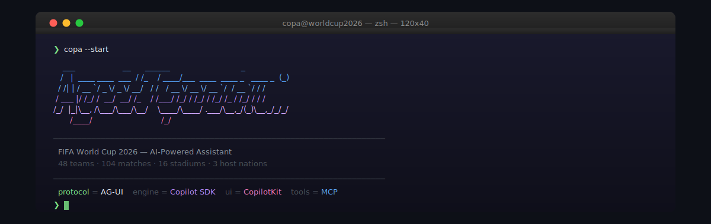

> An immersive, AI-powered experience to explore the **2026 FIFA World Cup** — 48 teams, 104 matches, 16 stadiums across 3 host nations 🇺🇸🇲🇽🇨🇦
>
> Built with the **[AG-UI Protocol](https://docs.ag-ui.com)**, the **[GitHub Copilot SDK](https://github.com/github/copilot-sdk)**, and **[MCP](https://modelcontextprotocol.io/)** weather tools.

📂 **Project documentation & configuration:**

| File | Description |
|------|-------------|
| [`/docs/README.md`](./docs/README.md) | Full documentation — problem → solution, prerequisites, setup, deployment, architecture diagram, RAI notes |
| [`/docs/docs-architecture.puml`](./docs/docs-architecture.puml) | PlantUML architecture diagram (AG-UI, Copilot SDK, MCP layers) |
| [`AGENTS.md`](./AGENTS.md) | Custom instructions for the Copa AI agent |
| [`mcp.json`](./mcp.json) | MCP server configuration (Open-Meteo weather) |

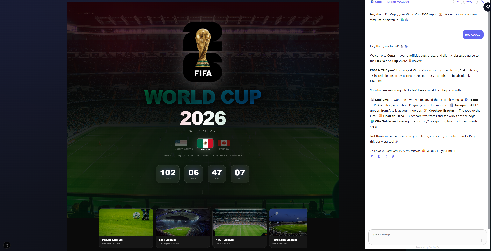

<p align="center">
  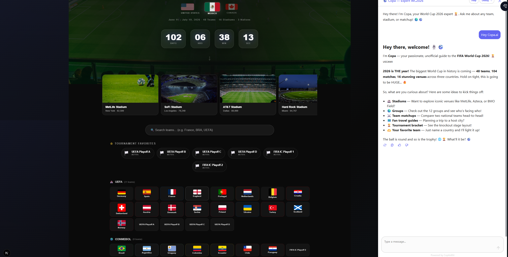
  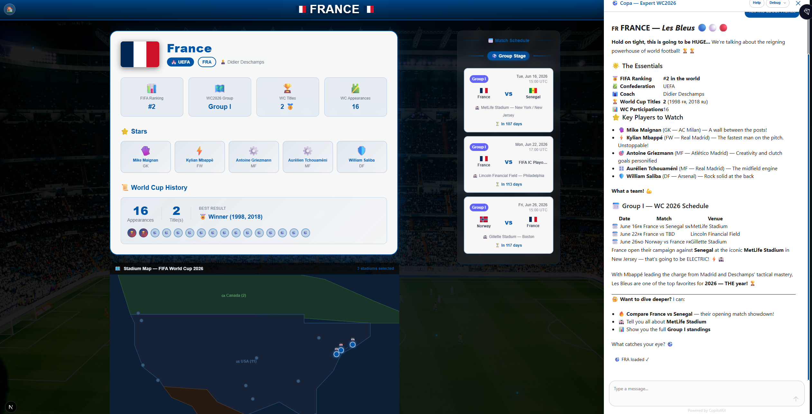
  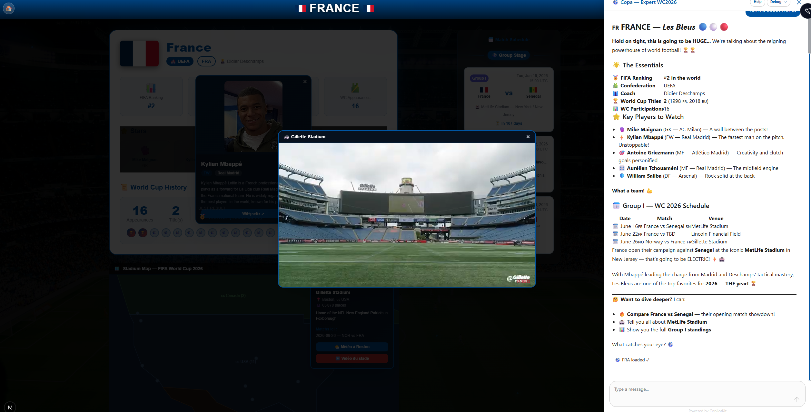
</p>
<p align="center">
  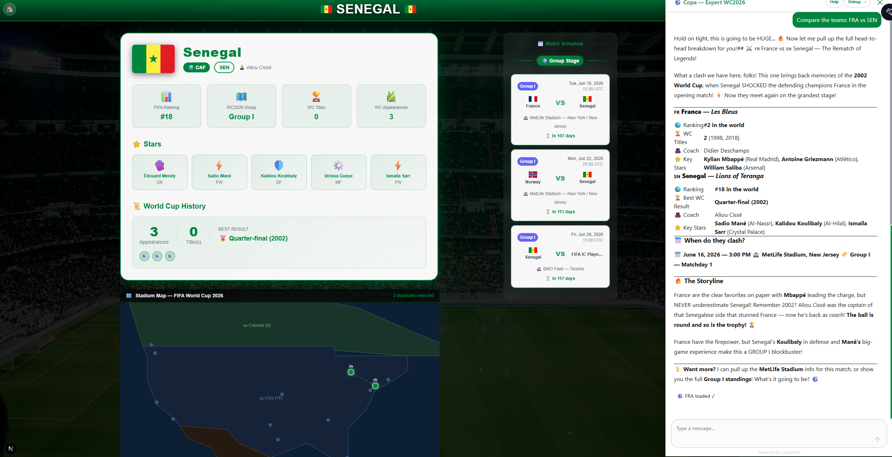
  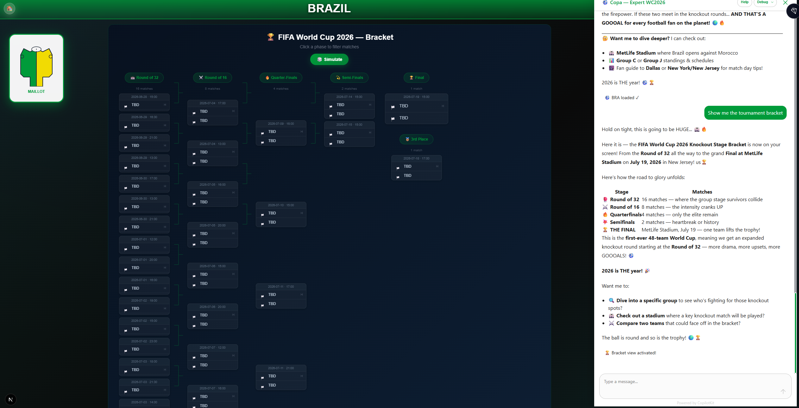
  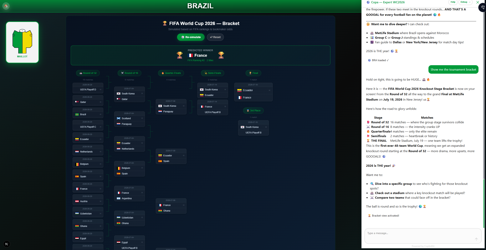
</p>
<p align="center">
  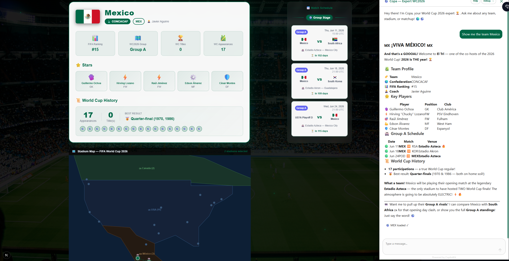
  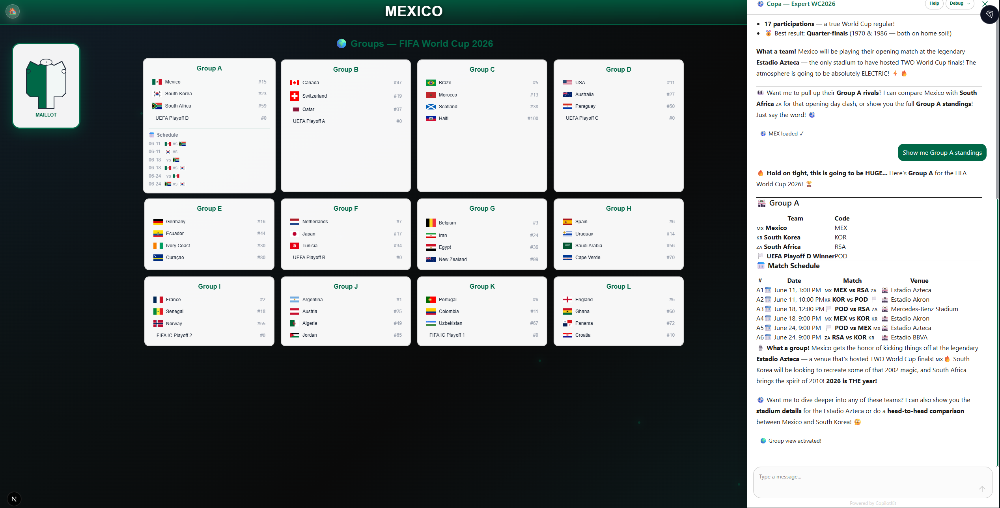
  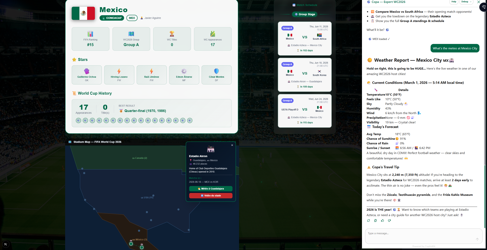
</p>

---

## 🎯 What Can Copa Do?

Copa is a **conversational AI sports commentator** that turns the FIFA World Cup 2026 into a living, interactive experience. The **entire page transforms in real time** as you chat — colors, data, maps, and cards all react to your conversation.

### 🗣️ Talk to Copa

| Try saying… | What happens on screen |
|---|---|
| *"Show me France"* | 🇫🇷 Full-page switch: blue theme, flag, roster, match schedule, stadiums on the SVG map |
| *"Now show Germany"* | 🇩🇪 Instant switch: black-red-gold theme, new players, new schedule |
| *"Compare Brazil vs Argentina"* | ⚔️ Rich side-by-side comparison card rendered **inside the chat** |
| *"Tell me about MetLife Stadium"* | 🏟️ Stadium card with capacity, location, hosted matches — in chat |
| *"Show Group C"* | 🌍 Interactive group view with all 4 teams, click any to navigate |
| *"Show the tournament bracket"* | 🏆 Full knockout bracket R32 → R16 → QF → SF → Final |
| *"What's the weather in Houston?"* | 🌤️ **Live weather data** via MCP (open-meteo) — real-time, not cached |
| *"City guide for Miami"* | 🏙️ Fan tips: food, transport, must-see spots near the stadium |

### 🖱️ Click & Explore

| Action | Effect |
|---|---|
| Click a **team flag** on the welcome screen | Page transforms with team's national colors and data |
| Click a **player card** | Modal with Wikipedia photo, bio, position & club |
| Click a **stadium dot** on the SVG map | Stadium details panel with weather & video buttons |
| Click **🌤️ Weather** on a stadium | Popup with live 5-day forecast from Open-Meteo API |
| Click **▶️ Video** on a stadium | Embedded YouTube player popup (no redirect) |
| Click a **match row** | Stadium pin highlights on the map |
| Click an **opponent flag** in the schedule | Triggers a compare prompt in Copa's chat |
| Click **🎲 Simulate** on the bracket | Simulates full tournament based on FIFA rankings |
| Navigate **Groups** / **Bracket** tabs | Interactive tournament views |

---

## 🏗️ Architecture Overview

Copa demonstrates a modern **AI-native frontend** pattern where a chat agent drives the entire UI.

### Macro Architecture

![Architecture](https://www.plantuml.com/plantuml/svg/bLN1Rjj64BqBq3yCf4Dj5x94oP4j8n5CYv9ZM8uDYqaAr8MnMex9ZSXTOdT9EIa2zDHJWRP0qAAvv99_Q2-zj7_Y7sW-eLYIKcJ9Qk4REVFUcxSpE-I1qaJg90g1I1emZLGd4iibDM4y9f94C2PquakHSAydGY6Xsd0iozfTXAY0U6BAk0_N95Hts1vUaoJK0y7rCn8XL4Re2uJdnvKrg15xWs2rrcGB2xsEOpcTHKnXK7AKO3KNCp6X4-BZeP0UoeBVQhJQBUSUr4ADVhll35fhCBdBdVlgBBVBQbk7pJkEg8XYmP7haNuT8aYacd0_n7in_-DxZljFvxQKOke6Z4uuAWNDbLp1VBHdjmU3SgbSqao728-l1TT0JV99fT2jW69ly4d5QbUwj-__X9w82Tn-zmxiXGi4PodAbE7qSTr8T8raqI2eVFhmyqSub6AgK5Q0A1Zdp_1jkGGmXpt36xtzIe7L1lWIu089rM1rCWR76_rAvGJut0Iez4JCGg5FcCu9bxnUJnJsXEsR_5-_G_QMWMogcU3rUgP89r2r1arxfx6YwIA9UaHw6KvJg3OTwx2nYdk1FC5J4cUuD5gBEoMQ1YCQe9U4c84ZjHPy94KIls0upO1-kXReYaHo4fah8mcTeCxjZjSINYBH0ShvoQPtJlQsN7fxPsgtxt_xvuyVOOGoHGcmCHkFVNuC5oBHk9cfg3oVJMPrBYFd91k46OjzL7j-3BVVluCY2IFd1CQIUJuMGo7PqAeDfxbdxQqg4d2521Li_FrhUpERTEmHZLSQIMH6RT14edaSvpsvv4eJZoLPsgnfdE6OVWr-mhnPNPt9LXjEwz3gBpVYquUFlu1z31S9ropA1oZpvvLZ7p7zD1al7j3OFF2P3f9ndURXcl8cHM7bJR8X3F8XB2WDXwU6UbVmagUCW1y0INHGI8HX1DMMq-mOYMNdF_m4_HkDafCmcoIZg38MpgBB9pZjdU-3Y97N8jGeZ8SXIn6c-UqfYaOqDklJS9hz9VvrI7pgyMqg8iCTXCG75X4VLK4r0FMPd3d-0Yum96OxLS1YLIvf2hMl0-PvoB-Hp0zq3TAeN4gZbN2aogL8hOJzj5poqvMm7fTBUhmIdbBZWawWbiIrhjdv_QLluTvXPwVJhtIL9Xhd7xav8uqUoeZKGnb--b267Z-KCLr_SedSGxdmVJSaJqnvhLlixJ8p_xjKkbjR-UgVIw455U7MLg5ooUylLQ-FHlrzSFjVkMPTtREpuLNF7WxDoyYrtVwLqn-wThs-u2QtC3EKBVHoq2pRsdwWKapmRONSixdtaZ2ziJcNDyoPYjctTIh5Pe8M4-HpTk4YlslTR7UM1UpMhZNODQqwxPq_i56W9U4g5b8lDCGiqAnWld7hF3zrtVE5FXuWzv8eB9V-1G00)

> 📐 PlantUML source: [`docs/architecture.puml`](docs/architecture.puml)

### The 4 Layers

| Layer | What | Why |
|---|---|---|
| **Next.js App** | React 19 frontend with CopilotKit hooks | Rich UI components that react to agent state |
| **AG-UI Protocol** | Open standard for agent ↔ frontend communication (SSE) | Streaming text, tool calls, state sync — all over one event stream |
| **GitHub Copilot SDK** | Node.js agent runtime with custom tools | Zero API keys — uses `gh auth`, custom tools, streaming |
| **MCP Servers** | Model Context Protocol for external data sources | Plug-and-play: live weather today, any data source tomorrow |

---

## 🔌 AG-UI Protocol — How It Works

The [AG-UI Protocol](https://docs.ag-ui.com) is an open standard for agent ↔ frontend communication. Copa uses it to stream text, coordinate tool calls, and synchronize state — all over Server-Sent Events (SSE).

| AG-UI Event | Copa Usage |
|---|---|
| `TEXT_MESSAGE_START/CONTENT/END` | Copa's commentary streams word-by-word |
| `TOOL_CALL_START/ARGS/END` | Agent invokes tools → frontend tracks execution |
| `STATE_DELTA` | Agent pushes state patches → `useCoAgent` updates React (team, bracket, group) |
| `RUN_STARTED / RUN_FINISHED` | Lifecycle: loading indicators, error handling |
| `RUN_ERROR` | Graceful error display in chat |

The `CopilotSDKAgent` class (in `copilot-sdk-agent.ts`) bridges Copilot SDK events to AG-UI:

```
Copilot SDK Event              →  AG-UI Event
─────────────────────────────────────────────────
assistant.message_delta        →  TEXT_MESSAGE_CONTENT
tool.execution_start           →  TOOL_CALL_START + TOOL_CALL_ARGS
tool.execution_complete        →  TOOL_CALL_END + STATE_DELTA (for UI tools)
session.idle                   →  TEXT_MESSAGE_END + RUN_FINISHED
session.error                  →  RUN_ERROR
```

### Data Flow — "Show me France"

![Sequence Diagram](https://www.plantuml.com/plantuml/svg/lLNBJkH65DqZyGzNPf66D3Hk61wjWOpnWo2w0U564oaTjGhxTdS9kygfAjDX41Ahp2RAIz58cGsRoIXIDjbDDjdCf_03uHEYSXjmG_FA8YjRhdFlFUVSMzSlf292fN444hzEaGKuFYOFA4k8837ia-2WAtZAGfj7NC34h6EQvc8H8diav7tAkj0XaHoA3h53qaXvdAaj4YCOFdOvmjw6SGVAfwyGpEeTfpa5UzandUKY9YSe60fO6kAMIxA4uFrcZmO73AM4wfsOlCIp9Ml1yqQXTeXGDA09OMgDYn157Z4tExSmvpmKSTDDSy5SguvaKuWgI7SNNCUR6uMlqmxMASD7ahg2ts9aLytgI0yTUaX354_GS1dnE4evkg1sQMrvVjaTXLqNF4sUm6I0lvy7u-eXzpB8muvfsBtpIWB5XssvFN03pCCICzo84HaVKrH52Cyxd2a8zE6AaPyQ8EahN37CUMFr_EtVu115m8ju7yvFVm73x_4-n0YU82n0utb5frZLARDYO5oS_VGEzYGA0uY4lV6nv7fQzUcRt_xvwmUmUK8ZhZQfQh7IBf90GO_p0pcPHNamONfLQtxsHlJvsryBmRwpQNMHwGpM-lJU1kmB6dPnaCBIwwYwP2xT8l3kpMK2y9tD5YlPzGsGwNuYU80oPs33HDKnlTcR32xElliH6lOE-2WEKRHOYIUASaQYGLn3CvzrggvsP0-cLy63sYtNChFe8L5ObEffk0Mr6sqPjDzOdPhAL4vDvPx3Rieo_L3oVNUoaBEWtOBfdCDmqi7rCLOhbTszhRRVj7QRhbEf5DffQJOsr42Yb9Ip6Oaij5Zuab1LAbOhM3K-PcVrj0Z5UJI3ts2GQd_QsP-anKff4XA5ROKaRbFMuMKupju37c8D36_NCauc7yExkRrTRzjMlJvWNwd0-RS_G_6xjRlkZ_ZiRXM5tbLepbjRVZQhNVURLjDjEswzQLrvts9V7lEaPWXC8XAWKOQ4g5xDg6Wj6wp3ZJ8SaYZ5sl7vwVj1rqzElj8EwGK0_115LZILQFD15mK6I0zHwbH1hyKqxoQIs2OYB8FgOOnba44FmpJ25YDH10CpWJAf25FH4LoSlVxZukprX-5M42bfXfY9KKhInNQ8aI9GaaeWYIdhFivnzujck-7wlhNkjktjhQQxrRnoiiLAVIv2s3y2_PmSPd0vGpICS7minElXoKVjAQMp1kPjrTFhRMnj-9yFZM-XWdNRz8kpxt-77T95e18OxqCdZQ8Zy0GoRVnQbEB0R_Zu0GIN2eL-YqcY7vSj6AhYwIehAtS8sCvtH0twI5GF1NHu5F7-T9fSNkQLbU6DyR97r2TIqxYAeGnsYA3oi_ztVpnv2zWwfd6BXpMtQ7gBcaV3thbc4QH285FjN6N9o3GQnTo5fTh8HaKJEbOO9pKmbpx-QPUXJrbO0xDw45TwPJW_VNyor9x6FPifu74IeS8dBPshMODF_zjzkNaB7hUe7nprcoFv0bcOnj7usBy0)

> 📐 PlantUML source: [`docs/sequence.puml`](docs/sequence.puml)

---

## 🧠 GitHub Copilot SDK — Zero-Key AI

The [GitHub Copilot SDK](https://github.com/github/copilot-sdk) (`@github/copilot-sdk`) runs the LLM — no OpenAI/Azure API keys required.

| Benefit | Detail |
|---|---|
| **Zero API keys** | Uses your `gh auth` token — if you have Copilot, you're ready |
| **Zero Python** | Everything runs in the Next.js Node.js process |
| **Custom tools** | Define tools with JSON Schema; the model calls them automatically |
| **Streaming** | Real-time token-by-token streaming translated to AG-UI events |
| **MCP support** | Native `mcpServers` in session config — plug any MCP server |

### Copa's 6 Custom Tools

All defined in `src/lib/copilot-sdk-agent.ts`:

| Tool | Type | What it does |
|---|---|---|
| `update_team_info` | Server → STATE_DELTA | Loads a team → pushes state patch → page transforms |
| `get_stadium_info` | Server + Generative UI | Returns stadium details → renders rich card in chat |
| `compare_teams` | Server + Generative UI | Head-to-head comparison → renders comparison grid in chat |
| `get_group_standings` | Server → STATE_DELTA | Returns group data → switches to GroupView |
| `show_tournament_bracket` | Server → STATE_DELTA | Activates bracket view → switches to TournamentBracket |
| `get_city_guide` | Server | Fan travel guide for a host city |

### MCP Server — Live Weather

Copa connects to the [open-meteo MCP server](https://mcp.open-meteo.com/) for **real-time weather data** at any World Cup venue. No API key, no configuration — it just works.

```typescript
// In copilot-sdk-agent.ts — session config
mcpServers: {
  weather: {
    type: "sse",
    url: "https://mcp.open-meteo.com/sse",
    tools: ["*"],  // All weather tools available
  },
},
```

> 💡 **Extensible**: Add any MCP-compatible server (news, sports stats, transit) by adding an entry to `mcpServers`.

---

## 🛠️ CopilotKit — Features Used

[CopilotKit](https://copilotkit.ai) provides the React integration layer between the AG-UI event stream and the UI components.

| Feature | Hook / Component | How Copa Uses It |
|---|---|---|
| **Co-Agent State** | `useCoAgent<AgentState>` | Bidirectional state: `teamInfo`, `matches`, `tournamentView`, `selectedStadium` |
| **Generative UI** | `useCopilotAction` with `render` | Rich stadium cards and comparison grids rendered inside the chat |
| **Copilot Readable** | `useCopilotReadable` | Provides current team context so the agent knows what the user sees |
| **Chat Suggestions** | `useCopilotChatSuggestions` | Dynamic follow-up prompts based on current state |
| **Chat Management** | `useCopilotChat` | Clicking an opponent flag auto-sends a compare prompt |
| **Sidebar / Popup** | `CopilotSidebar` / `CopilotPopup` | Desktop: persistent sidebar · Mobile: floating chat bubble |
| **CSS Theming** | `CopilotKitCSSProperties` | `--copilot-kit-primary-color` adapts to each team's national colors |

---

## ✨ Key Features

| Feature | Description |
|---|---|
| 🗣️ **Copa Agent** | Passionate WC2026 commentator with 6 custom tools + MCP weather |
| 🏳️ **48 national teams** | Full profiles: real flag images, key players, honors, FIFA ranking, national colors |
| 📅 **104 matches** | Complete schedule: group stage (72) → R32 (16) → R16 (8) → QF → SF → Final |
| 🗺️ **Interactive SVG map** | 16 stadiums across USA / Canada / Mexico with clickable pins |
| 🌍 **12 groups** | Responsive group view (A→L) with inter-team navigation |
| 🏆 **Tournament bracket** | Visual tree R32 → Final with **🎲 Simulate** button (FIFA ranking-based) |
| 🎨 **Dynamic theme** | Entire UI changes colors based on the selected team's national colors |
| 💬 **Generative UI** | Rich cards rendered inside the chat (stadiums, comparisons) |
| 🌤️ **Live weather** | Real-time weather via MCP + inline popup with 5-day forecast (Open-Meteo API) |
| 📸 **Player photos** | Click any player → Wikipedia photo, bio & club info in a modal |
| ▶️ **Stadium videos** | Embedded YouTube player popup on each stadium (no redirect) |
| 💡 **Smart suggestions** | AI-driven follow-up questions based on current context |
| 📱 **Mobile-first** | Mobile tabs + CopilotPopup / Desktop sidebar |
| ⏱️ **Live countdown** | Real-time countdown to June 11, 2026 |
| 🎟️ **Playoff teams** | 13 teams pending qualification shown with "Qualification Pending" message |

---

## 🚀 Quick Start

### Prerequisites

| Tool | Version | Install |
|---|---|---|
| Node.js | 20+ (v24 LTS recommended) | [nodejs.org](https://nodejs.org) |
| GitHub CLI | latest | `winget install GitHub.cli` |
| GitHub Copilot | Active subscription | [github.com/features/copilot](https://github.com/features/copilot) |

### 1. Clone & install

```bash
git clone https://github.com/fredgis/foot-agui-sample.git
cd foot-agui-sample
npm install
```

### 2. Authenticate with GitHub

```bash
gh auth login
```

The Copilot SDK uses your GitHub auth token — **no API keys needed**.

### 3. Run

```bash
npm run dev
```

Open **http://localhost:3000** and start chatting with Copa! ⚽

### 4. Try it

- 🏳️ Click a team flag → the page transforms with national colors
- 💬 Type: *"Show me France"* → blue theme, roster, schedule
- ⚔️ Try: *"Compare Brazil vs Argentina"* → rich comparison card in chat
- 🏟️ Ask: *"Tell me about MetLife Stadium"* → stadium card in chat
- 🌤️ Ask: *"What's the weather in New York?"* → live weather from MCP
- 🌍 Navigate Groups and Bracket views

---

## 📁 Project Structure

```
foot-agui-sample/
├── src/
│   ├── app/
│   │   ├── page.tsx                    # Main page — all CopilotKit hooks + components
│   │   ├── globals.css                 # Dark theme, animations, CopilotKit styles
│   │   ├── layout.tsx                  # CopilotKit Provider + metadata
│   │   └── api/copilotkit/route.ts     # CopilotRuntime → CopilotSDKAgent
│   ├── components/
│   │   ├── team-card.tsx               # Team profile (players w/ Wikipedia photos, honors)
│   │   ├── match-schedule.tsx          # 104 matches with phase/group filters
│   │   ├── venue-map.tsx               # SVG map — weather popup + YouTube video popup
│   │   ├── group-view.tsx              # 12 groups (A→L) responsive grid
│   │   └── tournament-bracket.tsx      # Bracket R32 → Final + 🎲 Simulate
│   └── lib/
│       ├── types.ts                    # Types: TeamInfo, MatchInfo, AgentState
│       ├── worldcup-data.ts            # 48 teams, 16 stadiums, 12 groups, 104 matches
│       ├── flags.ts                    # FIFA code → ISO → flagcdn.com images
│       └── copilot-sdk-agent.ts        # CopilotSDKAgent — AG-UI ↔ Copilot SDK bridge
├── docs/
│   ├── README.md                       # Detailed docs: problem/solution, setup, RAI notes
│   ├── docs-architecture.puml          # PlantUML — full architecture (AG-UI, SDK, MCP)
│   ├── architecture.puml               # PlantUML — macro architecture diagram
│   └── sequence.puml                   # PlantUML — data flow sequence diagram
├── AGENTS.md                           # Custom agent instructions for Copa
├── mcp.json                            # MCP server configuration (Open-Meteo weather)
├── scripts/
│   ├── deploy.ps1                      # One-click Azure deploy (idempotent, PowerShell 7+)
│   └── deploy-config.env.example       # Azure config template
├── package.json
└── README.md
```

---

## 🛠️ Available Scripts

| Command | Description |
|---|---|
| `npm run dev` | Start dev server (Next.js Turbopack) on `:3000` |
| `npm run build` | Production build |
| `npm run lint` | ESLint check |

---

## ☁️ Azure Deployment

Copa deploys as a single **Azure Static Web App** — no backend containers needed.

### One-click deploy (idempotent)

```powershell
Copy-Item scripts\deploy-config.env.example scripts\deploy-config.env
# Edit with your Azure subscription details

pwsh scripts\deploy.ps1
```

The script is **re-entrant**: safe to run multiple times (4 idempotent steps).

To tear down:
```powershell
az group delete --name rg-worldcup2026 --yes --no-wait
```

---

## 🔧 Tech Stack

| Layer | Technology | Version |
|---|---|---|
| Frontend | Next.js + React + TailwindCSS | 16 + 19 + 4 |
| Chat UI | CopilotKit (Sidebar + Popup) | 1.50 |
| Protocol | AG-UI (SSE events) | 0.0.46 |
| AI Agent | GitHub Copilot SDK | 0.1.29 |
| LLM | GitHub Copilot (via `gh auth`) | — |
| Weather | Open-Meteo MCP Server + API | — |
| Deployment | Azure Static Web Apps | — |
| Flags | flagcdn.com (CDN) | — |
| Player Photos | Wikipedia REST API | — |

---

## 📊 Project Stats

| Metric | Value |
|---|---|
| **Lines of code** | ~7,500 (TypeScript + CSS) |
| **React components** | 7 |
| **AI tools** | 6 custom + MCP weather |
| **WC2026 data** | 48 teams · 104 matches · 16 stadiums · 12 groups |

> 📋 See [`docs/README.md`](docs/README.md) for detailed architecture documentation and **Responsible AI (RAI) notes**.
>
> 📋 See [`AGENTS.md`](AGENTS.md) for custom agent instructions and [`mcp.json`](mcp.json) for MCP server configuration.

> 🤖 This project was developed collaboratively with **GitHub Copilot Agent** — from planning through architecture, implementation, debugging, and documentation.

---

## 📄 License

MIT — see [LICENSE](LICENSE)

---

**⚽ Built for the 2026 FIFA World Cup 🇺🇸🇲🇽🇨🇦**
**Powered by [AG-UI Protocol](https://docs.ag-ui.com) · [GitHub Copilot SDK](https://github.com/github/copilot-sdk) · [CopilotKit](https://copilotkit.ai) · [MCP](https://modelcontextprotocol.io/)**
