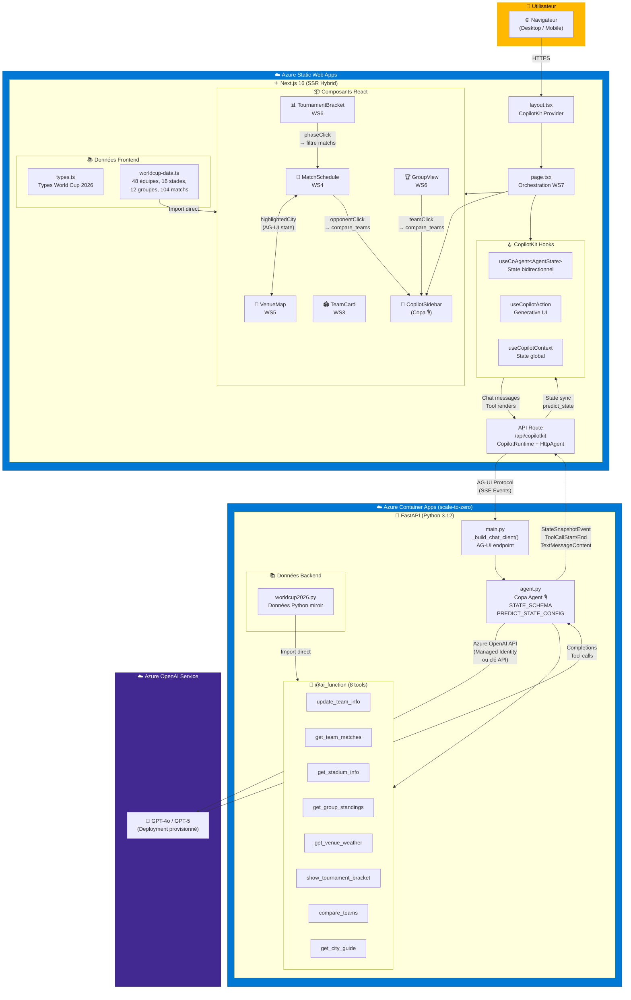
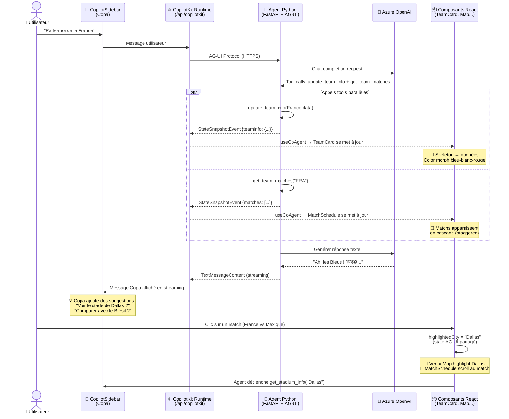
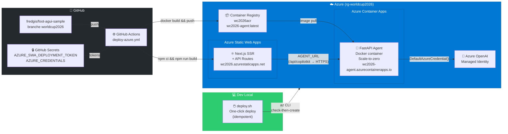
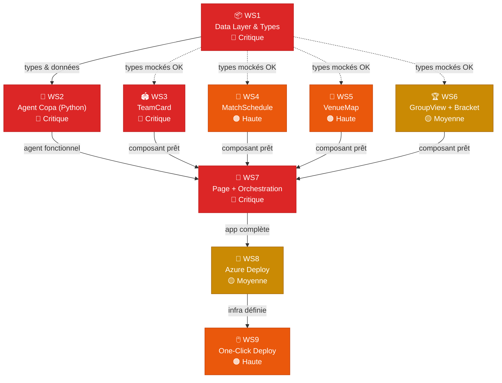

# 🏆 Plan de Développement — FIFA World Cup 2026 Edition

> **Branche** : `worldcup2026`  
> **Repo** : `fredgis/foot-agui-sample`  
> **Objectif** : Transformer l'assistant football (clubs & équipes nationales) en une expérience immersive centrée sur la Coupe du Monde 2026 🇺🇸🇲🇽🇨🇦

---

## 📊 Analyse de l'Existant

Le projet actuel repose sur une architecture à deux couches que nous **préservons intégralement** :

| Couche | Stack actuelle | Fichiers clés |
|--------|---------------|---------------|
| **Frontend** | Next.js 16 + React 19 + TailwindCSS 4 + CopilotKit | `src/app/page.tsx`, `src/components/clubinfo.tsx`, `src/lib/types.ts` |
| **Agent Backend** | Python 3.12 + FastAPI + Microsoft Agent Framework + AG-UI Protocol | `agent/src/agent.py`, `agent/src/main.py` |
| **Communication** | AG-UI Protocol (`@ag-ui/client` frontend, `agent-framework-ag-ui` Python) via CopilotKit Runtime | `src/app/layout.tsx`, `src/app/api/copilotkit/route.ts` |
| **State Sync** | CoAgent shared state (`clubInfo` schema) avec `predict_state` | `agent/src/agent.py` (`STATE_SCHEMA`, `PREDICT_STATE_CONFIG`) |

### État actuel de l'agent

L'agent Python expose 3 fonctions :
- `update_club_info` — Met à jour les infos d'un club/sélection
- `get_weather` — Météo d'une localisation
- `go_to_moon` — Human-in-the-loop (demo)

Le state partagé AG-UI est centré sur un unique objet `clubInfo`.

### Stack Frontend (npm)

```json
"@ag-ui/client": "^0.0.42",
"@copilotkit/react-core": "^1.50.1",
"@copilotkit/react-textarea": "^1.50.1",
"@copilotkit/react-ui": "^1.50.1",
"@copilotkit/runtime": "^1.50.1",
"next": "16.0.8",
"react": "^19.2.1"
```

### Stack Agent (Python)

```toml
requires-python = ">=3.12"
dependencies = [
    "agent-framework-ag-ui>=1.0.0b251117",
    "python-dotenv",
]
```

---

## 🏗️ Architecture Technique

### Schéma d'Architecture Global



### Schéma du Flux AG-UI (Sequence)



### Schéma de Déploiement Azure



### Schéma des Workstreams & Dépendances



### Prérequis Techniques Garantis

| Prérequis | Statut | Détail |
|-----------|--------|--------|
| **AG-UI Protocol** | ✅ Conservé | `@ag-ui/client` (frontend) + `agent-framework-ag-ui` (Python) — même protocole, mêmes events SSE |
| **GitHub Copilot SDK (CopilotKit)** | ✅ Conservé | `@copilotkit/react-core` v1.50+, `@copilotkit/react-ui`, `@copilotkit/runtime` — hooks `useCoAgent`, `useCopilotAction` |
| **Microsoft Agent Framework** | ✅ Conservé | `agent_framework` + `ChatAgent` + `@ai_function` — même infra Python |
| **State Sync bidirectionnel** | ✅ Conservé | `predict_state` + `STATE_SCHEMA` côté agent ↔ `useCoAgent` côté React |
| **Next.js + React 19** | ✅ Conservé | Même structure `src/app/` |
| **FastAPI** | ✅ Conservé | `agent/src/main.py` inchangé (structure) |

### Flux Complet AG-UI + CopilotKit

```
Utilisateur → CopilotSidebar (CopilotKit SDK)
                    ↓
            CopilotKit Runtime (/api/copilotkit)
                    ↓ AG-UI Protocol (events SSE)
            FastAPI (agent/src/main.py)
                    ↓
            Agent Python (agent/src/agent.py)
              - @ai_function → update_team_info, get_team_matches...
              - STATE_SCHEMA → predict_state → StateSnapshotEvent
                    ↓ AG-UI Protocol (events remontés)
            CopilotKit Runtime
                    ↓
            useCoAgent<AgentState> (src/app/page.tsx)
                    ↓
            Composants React (src/components/*.tsx)
              - TeamCard, MatchSchedule, VenueMap, GroupView, Bracket
```

### Détail du protocole AG-UI

Le protocole AG-UI (Agent-to-User Interface) est le lien entre l'agent Python et le frontend React :

1. **Côté Agent (Python)** : `agent-framework-ag-ui` expose un endpoint FastAPI qui émet des events SSE :
   - `StateSnapshotEvent` — Synchronise le state partagé (teamInfo, matches, etc.)
   - `ToolCallStart` / `ToolCallEnd` — Signale le début/fin d'un appel de tool
   - `TextMessageContent` — Texte de l'agent en streaming

2. **Côté Runtime (Next.js)** : `@copilotkit/runtime` reçoit les events via `HttpAgent` :
   ```typescript
   // src/app/api/copilotkit/route.ts
   const runtime = new CopilotRuntime({
     agents: {
       "my_agent": new HttpAgent({ url: "http://localhost:8000/" }),
     }
   });
   ```

3. **Côté Frontend (React)** : `@copilotkit/react-core` expose les hooks :
   - `useCoAgent<AgentState>` — State bidirectionnel avec l'agent
   - `useCopilotAction` — Render UI pour les tool calls (Generative UI)
   - `useCopilotContext` — Accès direct au state global

### Détail GitHub Copilot SDK (CopilotKit)

CopilotKit est le SDK qui orchestre toute l'expérience :

```typescript
// src/app/layout.tsx — Provider global
<CopilotKit runtimeUrl="/api/copilotkit" agent="my_agent">
  {children}
</CopilotKit>

// src/app/page.tsx — Hooks utilisés
import { useCoAgent, useCopilotAction, useCopilotContext } from "@copilotkit/react-core";
import { CopilotKitCSSProperties, CopilotSidebar } from "@copilotkit/react-ui";
```

**Hooks clés :**
- `useCoAgent<AgentState>({ name: "my_agent" })` — Shared state bidirectionnel
- `useCopilotAction({ name: "tool_name", render: ... })` — Generative UI pour les tools
- `useCopilotContext()` — Accès au state global pour les effets réactifs
- `CopilotSidebar` — Composant UI de chat en sidebar

---

## 🎯 Vision UX Immersive

Quand l'utilisateur mentionne une équipe (ex: « Parle-moi de la France »), l'interface se transforme dynamiquement :

- 🎨 **Thème dynamique** — Le thème complet passe aux couleurs de l'équipe avec **color morph** animé (CSS transition sur les variables)
- 🏟️ **Carte d'identité** — Drapeau, confédération, classement FIFA, sélectionneur, joueurs stars
- 📅 **Calendrier des matchs** — Dates, adversaires, stades, compte à rebours
- 📍 **Carte interactive** — Les 16 villes hôtes avec les stades où l'équipe joue en surbrillance
- 🏆 **Vue du groupe** — Les 4 équipes du groupe avec le calendrier croisé
- 📊 **Bracket du tournoi** — L'arbre complet avec la branche de l'équipe mise en avant
- 🌦️ **Météo enrichie** — Météo des villes de match contextualisée
- 🎙️ **Agent « Copa »** — Un vrai personnage avec nom, tics de langage, et adaptation linguistique par équipe
- ⏳ **Loading progressif** — Skeleton loaders + staggered reveal (TeamCard d'abord, puis matchs en cascade, puis carte)
- 🔗 **Composants interconnectés** — Clic sur un match → highlight stade + météo ; clic adversaire → compare_teams automatique
- 🔄 **Transitions fluides** — Fade-out/slide-in au changement d'équipe, animation de déplacement sur la carte

### Layout Dynamique — Mobile-First

**Mobile** (prioritaire — majorité du trafic World Cup) :

```
┌────────────────────────────┐
│  🏆 TeamCard (collapsible) │
├────────────────────────────┤
│  [Matchs] [Carte] [Groupe] │  ← Tabs navigation
├────────────────────────────┤
│                            │
│   Contenu du tab actif     │
│   (MatchSchedule OU        │
│    VenueMap OU GroupView)  │
│                            │
├────────────────────────────┤
│  💬 Chat toggle (bottom)   │  ← Bouton flottant → chat plein écran
└────────────────────────────┘
```

**Desktop** :

```
┌──────────────────────────────────┬────────────────┐
│                                  │                │
│   TeamCard (WS3) — Haut         │   CopilotKit   │
│                                  │   Sidebar      │
├──────────────┬───────────────────│   Chat         │
│              │                   │   (Copa 🎙️)   │
│ MatchSchedule│   VenueMap (WS5)  │                │
│   (WS4)      │                   │   Suggestions  │
│              │                   │   proactives   │
├──────────────┴───────────────────│                │
│                                  │                │
│  GroupView / TournamentBracket   │                │
│  (WS6) — Toggle entre les 2     │                │
│                                  │                │
└──────────────────────────────────┴────────────────┘
```

---

## 📁 Structure des Fichiers (Cible)

### Frontend (`/src`)

```
src/
├── app/
│   ├── layout.tsx              ← CopilotKit provider (conservé, URL externalisable)
│   ├── page.tsx                ← Page principale (refonte WS7)
│   ├── globals.css             ← Styles + thème dynamique WC2026 (enrichi)
│   └── api/copilotkit/
│       └── route.ts            ← Runtime endpoint (conservé)
├── components/
│   ├── team-card.tsx           ← NOUVEAU (remplace clubinfo.tsx) — WS3
│   ├── match-schedule.tsx      ← NOUVEAU — WS4
│   ├── venue-map.tsx           ← NOUVEAU — WS5
│   ├── group-view.tsx          ← NOUVEAU — WS6
│   ├── tournament-bracket.tsx  ← NOUVEAU — WS6
│   ├── weather.tsx             ← Conservé et enrichi (météo villes hôtes)
│   ├── clubinfo.tsx            ← SUPPRIMÉ (remplacé par team-card.tsx)
│   ├── moon.tsx                ← SUPPRIMÉ (demo, plus nécessaire)
│   └── proverbs.tsx            ← SUPPRIMÉ (demo, plus nécessaire)
└── lib/
    ├── types.ts                ← Refonte avec types World Cup 2026 — WS1
    └── worldcup-data.ts        ← NOUVEAU — Données statiques WC2026 — WS1
```

### Agent Python (`/agent`)

```
agent/
├── src/
│   ├── agent.py                ← Refonte WC2026 — WS2
│   ├── main.py                 ← Conservé (FastAPI + AG-UI endpoint)
│   └── data/
│       └── worldcup2026.py     ← NOUVEAU — Données Python WC2026 — WS1
├── pyproject.toml              ← Conservé
├── .python-version             ← Conservé (3.12)
└── .env.example                ← NOUVEAU — Template de configuration
```

### Racine du projet

```
/
├── .github/
│   └── workflows/
│       └── deploy-azure.yml          ← NOUVEAU — CI/CD Azure SWA + Container Apps — WS8
├── .env.example                      ← NOUVEAU — Template frontend — WS8
├── scripts/
│   ├── deploy.sh                     ← NOUVEAU — One-click deploy Bash — WS9
│   ├── deploy.ps1                    ← NOUVEAU — One-click deploy PowerShell — WS9
│   └── deploy-config.env.example     ← NOUVEAU — Template config déploiement — WS9
├── docs/
│   └── worldcup2026-development-plan.md  ← CE FICHIER
└── ... (fichiers existants conservés)
```

---

## 📋 Workstream 1 — 📦 Data Layer & Types World Cup 2026

> **Priorité** : 🔴 Critique  
> **Dépendances** : Aucune  
> **Parallélisable** : ✅ Immédiatement

### Objectif

Créer la base de données complète du tournoi + les types partagés frontend/backend.

### Fichiers à créer/modifier

| Fichier | Action | Description |
|---------|--------|-------------|
| `src/lib/types.ts` | Refonte | Nouveaux types TypeScript World Cup 2026 |
| `src/lib/worldcup-data.ts` | Création | Données statiques côté frontend (48 équipes, 16 stades, 12 groupes, calendrier) |
| `agent/src/data/worldcup2026.py` | Création | Mêmes données côté Python pour l'agent |

### Données structurées à inclure

- **48 équipes** : nom, code FIFA, drapeau emoji, confédération (UEFA, CONMEBOL, CAF, AFC, CONCACAF, OFC), classement FIFA, couleurs primaire/secondaire, sélectionneur, 5 joueurs clés (nom, poste, club), historique WC (participations, titres, meilleur résultat)
- **16 stades** : nom, ville, pays (USA/Canada/Mexique), capacité, coordonnées GPS, fuseau horaire, description
- **12 groupes** (A→L) : composition de chaque groupe (4 équipes)
- **104 matchs** : date/heure, équipes, stade, phase du tournoi (groupe, huitièmes, quarts, demis, 3e place, finale)

### Types TypeScript à définir

```typescript
// src/lib/types.ts — World Cup 2026

export interface TeamInfo {
  name: string;
  code: string;                // Code FIFA (FRA, BRA, USA...)
  flag: string;                // Emoji drapeau 🇫🇷
  confederation: string;       // UEFA, CONMEBOL, CAF, AFC, CONCACAF, OFC
  fifaRanking: number;
  primaryColor: string;        // Couleur hex primaire
  secondaryColor: string;      // Couleur hex secondaire
  coach: string;               // Sélectionneur
  group: string;               // Groupe WC2026 (A-L)
  stars: PlayerInfo[];         // 5 joueurs clés
  wcHistory: WorldCupHistory;
}

export interface PlayerInfo {
  name: string;
  position: string;            // GK, DEF, MID, FWD
  club: string;                // Club actuel
}

export interface WorldCupHistory {
  participations: number;
  titles: number;
  bestResult: string;          // "Champion", "Finalist", "Semi-finalist", etc.
  titleYears?: string[];       // ["1998", "2018"]
}

export interface StadiumInfo {
  name: string;
  city: string;
  country: string;             // "USA", "Canada", "Mexico"
  capacity: number;
  latitude: number;
  longitude: number;
  timezone: string;            // "America/New_York", etc.
  description: string;
}

export interface MatchInfo {
  id: string;
  date: string;                // ISO 8601
  teamA: string;               // Code FIFA ou "TBD"
  teamB: string;
  stadium: string;             // Nom du stade
  phase: MatchPhase;
  group?: string;              // Groupe (si phase de groupe)
}

export type MatchPhase = 
  | "group" 
  | "round-of-32" 
  | "round-of-16" 
  | "quarter-final" 
  | "semi-final" 
  | "third-place" 
  | "final";

export interface GroupInfo {
  name: string;                // "A", "B", ..., "L"
  teams: string[];             // Codes FIFA des 4 équipes
}

// State AG-UI partagé (remplace l'ancien AgentState)
export type AgentState = {
  teamInfo: TeamInfo | null;
  matches: MatchInfo[];
  selectedStadium: StadiumInfo | null;
  tournamentView: "group" | "bracket" | null;
  highlightedCity: string | null;
};
```

### Critères d'acceptation

- [ ] Tous les types TypeScript compilent sans erreur
- [ ] Les 48 équipes qualifiées sont présentes avec données complètes
- [ ] Les 16 stades sont présents avec coordonnées GPS
- [ ] Les 12 groupes sont correctement composés
- [ ] Le calendrier des matchs de phase de groupes est complet (dates réelles FIFA)
- [ ] Les données Python mirrorent exactement les données TypeScript
- [ ] Les données sont accessibles via import simple (`import { teams, stadiums } from "@/lib/worldcup-data"`)

---

## 📋 Workstream 2 — 🤖 Agent Backend Python (Refonte)

> **Priorité** : 🔴 Critique  
> **Dépendances** : WS1 (types & données)  
> **Parallélisable** : ⚠️ Dès que WS1 a les types

### Objectif

Transformer l'agent de « expert clubs » en « expert World Cup 2026 ».

### Fichier principal : `agent/src/agent.py`

### Nouveau STATE_SCHEMA

Remplacer `clubInfo` par le nouveau schema aligné sur les types TypeScript :

```python
STATE_SCHEMA = {
    "teamInfo": {
        "type": ["object", "null"],
        "properties": {
            "name": {"type": "string"},
            "code": {"type": "string"},
            "flag": {"type": "string"},
            "confederation": {"type": "string"},
            "fifaRanking": {"type": "number"},
            "primaryColor": {"type": "string"},
            "secondaryColor": {"type": "string"},
            "coach": {"type": "string"},
            "group": {"type": "string"},
            "stars": {"type": "array", ...},
            "wcHistory": {"type": "object", ...},
        },
    },
    "matches": {"type": "array", ...},
    "selectedStadium": {"type": ["object", "null"], ...},
    "tournamentView": {"type": ["string", "null"]},
    "highlightedCity": {"type": ["string", "null"]},
}
```

### Nouvelles `@ai_function` (remplacent les existantes)

| Fonction | Description | Déclenche le state |
|----------|-------------|-------------------|
| `update_team_info(team_info)` | Charge une équipe nationale dans le state | `teamInfo` |
| `get_team_matches(team_code)` | Retourne les matchs WC2026 de l'équipe | `matches` |
| `get_stadium_info(stadium_name)` | Détails d'un stade | `selectedStadium` |
| `get_group_standings(group)` | Composition et calendrier d'un groupe | `tournamentView = "group"` |
| `get_venue_weather(city)` | Météo de la ville hôte (enrichie) | — |
| `show_tournament_bracket()` | Basculer la vue bracket | `tournamentView = "bracket"` |
| `compare_teams(team_a, team_b)` | Comparaison head-to-head | — |
| `get_city_guide(city)` | Guide fan de la ville hôte | — |

### Nouveau `PREDICT_STATE_CONFIG`

```python
PREDICT_STATE_CONFIG = {
    "teamInfo": {
        "tool": "update_team_info",
        "tool_argument": "team_info",
    },
    "matches": {
        "tool": "get_team_matches",
        "tool_argument": "team_code",
    },
    "selectedStadium": {
        "tool": "get_stadium_info",
        "tool_argument": "stadium_name",
    },
    "tournamentView": {
        "tool": "show_tournament_bracket",
        "tool_argument": None,
    },
    "highlightedCity": {
        "tool": "get_stadium_info",
        "tool_argument": "stadium_name",
    },
}
```

### Nouveau System Prompt — Agent « Copa » 🎙️

L'agent a une **vraie identité** :

- **Nom** : « Copa » — guide officieux de la World Cup 2026
- **Personnalité** : Commentateur sportif passionné, expert tactique, chaleureux
- **Tics de langage** : « *Et c'est le but !* », « *Quelle équipe !* », « *Attention, ça va être du lourd...* »
- **Langue** : Français par défaut, mais **s'adapte à l'équipe** :
  - France → français pur : « *Allez les Bleus !* »
  - Brésil → mots portugais : « *A Seleção, que saudade do jogo bonito !* »
  - Angleterre → anglais : « *It's coming home!* »
  - Argentine → espagnol : « *¡Vamos la Albiceleste!* »
  - Retour au français pour l'explication détaillée
- **Comportement proactif** (CRITIQUE pour l'immersion) :
  - Après avoir parlé d'une équipe → suggère l'adversaire du 1er match : « *Tu veux voir leur adversaire du 11 juin, le Mexique ? 🇲🇽* »
  - Après un `compare_teams` → rebondit : « *Ils se croisent en poule le 15 juin à Dallas — je te montre le stade ?* »
  - En fin de conversation → propose : « *Tu veux que je te fasse le pronostic de leur parcours dans le tournoi ?* »
  - Utilise les `suggestions` CopilotKit pour afficher des boutons de relance dans le chat
- **Comportement automatique** : Appelle TOUJOURS `update_team_info` + `get_team_matches` quand une équipe est mentionnée
- **Anecdotes** : Pas juste des stats — des histoires inattendues sur les stades, les villes, les joueurs
- **Restriction** : UNIQUEMENT la Coupe du Monde 2026 et le football (décline poliment les autres sujets)

### Fichier inchangé

`agent/src/main.py` — L'infrastructure FastAPI + AG-UI endpoint reste identique. Seule la configuration Azure OpenAI sera documentée.

### Critères d'acceptation

- [ ] Le nouveau `STATE_SCHEMA` est aligné avec les types TypeScript de WS1
- [ ] Les 8 `@ai_function` sont implémentées et fonctionnelles
- [ ] L'agent répond correctement quand on mentionne une équipe (appel automatique)
- [ ] Le `PREDICT_STATE_CONFIG` synchronise correctement le state frontend
- [ ] Le system prompt donne à l'agent l'identité « Copa » avec tics de langage
- [ ] L'agent est **proactif** : suggère l'adversaire, le stade, le pronostic après chaque réponse
- [ ] L'agent **adapte sa langue** aux couleurs de l'équipe mentionnée (mots portugais pour le Brésil, etc.)
- [ ] L'agent refuse poliment les sujets hors football/WC2026
- [ ] `agent/src/main.py` reste fonctionnel avec Azure OpenAI

---

## 📋 Workstream 3 — 🏟️ Composant TeamCard (Carte d'Identité Équipe)

> **Priorité** : 🔴 Critique  
> **Dépendances** : WS1 (types)  
> **Parallélisable** : ✅ Avec WS4, WS5, WS6

### Objectif

Remplacer `ClubInfoCard` (`src/components/clubinfo.tsx`) par un composant immersif d'équipe nationale.

### Fichier : `src/components/team-card.tsx`

### UX Immersive

- **Header animé** : drapeau emoji géant + nom de l'équipe + badge confédération (UEFA, CONMEBOL, etc.)
- **Grille de stats** (4 colonnes) :
  - Classement FIFA
  - Groupe WC2026
  - Titres World Cup
  - Participations World Cup
- **Section « Stars »** : 5 joueurs clés avec nom, poste, club — style cartes de joueur avec hover → mini-popup stats
- **Section « Historique WC »** : frise des participations passées avec le meilleur résultat en highlight
- **Thème dynamique** : toute la card prend `primaryColor` / `secondaryColor` de l'équipe
- **Skeleton loader** : quand `team` est en cours de chargement, afficher un squelette animé (pulsing gray blocks) à la place des données — donne la sensation que l'agent construit l'expérience en temps réel
- **Transition inter-équipes** : fade-out (300ms) de l'ancienne card → slide-in (400ms) de la nouvelle avec color morph progressif
- **Animations** : `slideIn 0.6s ease-out` à l'apparition, staggered reveal des sections (header → stats → stars → historique)

### Props

```typescript
interface TeamCardProps {
  team: TeamInfo | null;
  themeColor: string;
  secondaryColor: string;
}
```

### Critères d'acceptation

- [ ] Le composant affiche toutes les informations d'une équipe nationale
- [ ] Le thème dynamique s'applique correctement (couleurs de l'équipe)
- [ ] Les animations d'entrée fonctionnent
- [ ] Le composant gère le cas `team = null` (placeholder)
- [ ] Responsive : s'adapte aux différentes tailles d'écran

---

## 📋 Workstream 4 — 📅 Composant MatchSchedule (Calendrier des Matchs)

> **Priorité** : 🟠 Haute  
> **Dépendances** : WS1 (types)  
> **Parallélisable** : ✅ Avec WS3, WS5, WS6

### Fichier : `src/components/match-schedule.tsx`

### UX Immersive

- **Timeline verticale** des matchs de l'équipe dans le tournoi
- Chaque match affiche :
  - Drapeaux des 2 équipes + « VS » animé
  - Date/heure (locale & UTC)
  - Stade + ville
  - Badge de phase (Groupe, R32, R16, QF, SF, Final) avec couleur
- **Compte à rebours** « Dans X jours » pour les matchs futurs (basé sur la date du 11 juin 2026)
- **Séparateurs visuels** entre phase de groupe et phases à élimination directe
- **Skeleton loader** : les matchs apparaissent un par un en cascade (staggered 100ms) quand le state AG-UI les reçoit
- **Interactions cross-composants** (via state AG-UI partagé) :
  - Clic sur un match → envoie `highlightedCity` au state → highlight du stade sur la carte (WS5) + affiche la météo
  - Clic sur le drapeau adversaire → l'agent lance automatiquement un `compare_teams` dans le chat
  - Hover sur le nom du stade → tooltip avec capacité + photo/icône
- **Animations** : apparition progressive au scroll (staggered animation)

### Props

```typescript
interface MatchScheduleProps {
  matches: MatchInfo[];
  teamCode: string;
  themeColor: string;
  onMatchClick?: (match: MatchInfo) => void;
  onOpponentClick?: (opponentCode: string) => void;  // → déclenche compare_teams
}
```

### Critères d'acceptation

- [ ] Affiche correctement tous les matchs d'une équipe
- [ ] Le compte à rebours est fonctionnel
- [ ] Les badges de phase sont correctement colorés
- [ ] Le clic sur un match highlight le stade sur la carte (cross-composant)
- [ ] Le clic sur un adversaire déclenche une interaction agent
- [ ] Les séparateurs entre phases sont visibles
- [ ] Skeleton loader avec staggered reveal fonctionne
- [ ] Responsive (stack vertical sur mobile)

---

## 📋 Workstream 5 — 📍 Composant VenueMap (Carte Interactive)

> **Priorité** : 🟠 Haute  
> **Dépendances** : WS1 (types)  
> **Parallélisable** : ✅ Avec WS3, WS4, WS6

### Fichier : `src/components/venue-map.tsx`

### UX Immersive

- **Carte SVG stylisée** USA/Canada/Mexique (pur SVG/CSS, pas de Google Maps)
- **16 pins** pour les 16 stades, positionnés par coordonnées GPS normalisées
- **Highlight dynamique** : quand une équipe est sélectionnée, les stades où elle joue brillent avec la couleur de l'équipe
- **Ligne pointillée** reliant les stades du parcours de l'équipe (itinéraire de match)
- **Tooltip au hover** : nom du stade, capacité, date du prochain match
- **Mini-card au clic** : icône du stade + infos détaillées + lien vers la météo
- **3 zones visuelles** : USA (11 villes), Canada (2), Mexique (3) avec séparation légère
- **Interactions cross-composants** (via state AG-UI partagé) :
  - Réagit au `highlightedCity` envoyé par MatchSchedule (WS4) — zoom + pulse sur le stade concerné
  - Clic sur un stade → scroll automatique vers le match dans MatchSchedule + l'agent déclenche `get_stadium_info`
  - **Animation de voyage** : quand on change d'équipe, les highlights se déplacent en animation du parcours de l'ancienne équipe vers la nouvelle
- **Transition inter-équipes** : les pins de l'ancienne équipe fade-out, ceux de la nouvelle pulse-in avec la nouvelle couleur

### Villes hôtes (16)

| Pays | Villes |
|------|--------|
| 🇺🇸 USA (11) | New York/New Jersey, Los Angeles, Dallas, Houston, Atlanta, Philadelphia, Miami, Seattle, San Francisco, Kansas City, Boston |
| 🇨🇦 Canada (2) | Toronto, Vancouver |
| 🇲🇽 Mexique (3) | Mexico City, Guadalajara, Monterrey |

### Props

```typescript
interface VenueMapProps {
  stadiums: StadiumInfo[];
  teamMatches?: MatchInfo[];
  highlightedCity?: string | null;
  themeColor: string;
  onStadiumClick?: (stadium: StadiumInfo) => void;
}
```

### Critères d'acceptation

- [ ] La carte SVG affiche correctement les 3 pays
- [ ] Les 16 stades sont correctement positionnés
- [ ] Le highlight dynamique fonctionne quand une équipe est sélectionnée
- [ ] Les tooltips s'affichent au hover
- [ ] Les lignes de parcours d'équipe se dessinent
- [ ] Réagit au `highlightedCity` provenant de MatchSchedule (cross-composant)
- [ ] Le clic sur un stade déclenche une interaction avec l'agent
- [ ] Transition animée au changement d'équipe
- [ ] Responsive

---

## 📋 Workstream 6 — 🏆 Composants GroupView & TournamentBracket

> **Priorité** : 🟡 Moyenne  
> **Dépendances** : WS1 (types)  
> **Parallélisable** : ✅ Avec WS3, WS4, WS5

### Fichiers

- `src/components/group-view.tsx`
- `src/components/tournament-bracket.tsx`

### GroupView UX

- **12 groupes** (A→L) affichés en grille 3×4 ou 4×3 responsive
- Chaque groupe : 4 équipes avec drapeau + nom + classement FIFA
- **Highlight du groupe de l'équipe sélectionnée** (bordure + glow aux couleurs de l'équipe)
- Mini-calendrier des 6 matchs du groupe intégré
- Clic sur un groupe → zoom/expand pour voir les détails
- **Interaction cross-composant** : clic sur une autre équipe du groupe → l'agent lance `compare_teams` automatiquement dans le chat

### TournamentBracket UX

- **Arbre SVG complet** : R32 → R16 → QF → SF → 3e place → Finale
- **Bracket interactif** : la branche de l'équipe sélectionnée est mise en surbrillance
- Animation de révélation progressive (de gauche à droite)
- **Interaction cross-composant** : clic sur une phase → filtre MatchSchedule (WS4) pour ne montrer que cette phase
- Responsive : scroll horizontal sur mobile

### Props

```typescript
// group-view.tsx
interface GroupViewProps {
  groups: GroupInfo[];
  selectedTeamCode?: string;
  themeColor: string;
  onGroupClick?: (group: GroupInfo) => void;
  onTeamClick?: (teamCode: string) => void;  // → déclenche compare_teams ou switch équipe
}

// tournament-bracket.tsx
interface TournamentBracketProps {
  matches: MatchInfo[];
  selectedTeamCode?: string;
  themeColor: string;
  onPhaseClick?: (phase: MatchPhase) => void;  // → filtre MatchSchedule
}
```

### Critères d'acceptation

- [ ] Les 12 groupes s'affichent correctement
- [ ] Le highlight de groupe fonctionne
- [ ] Clic sur une équipe du groupe déclenche une interaction agent
- [ ] Le bracket du tournoi est complet et lisible
- [ ] La surbrillance de branche fonctionne
- [ ] Clic sur une phase filtre les matchs (cross-composant)
- [ ] Les deux composants sont responsive

---

## 📋 Workstream 7 — 🎪 Page Principale & Orchestration (Intégration Finale)

> **Priorité** : 🔴 Critique  
> **Dépendances** : WS2, WS3, WS4, WS5, WS6  
> **Parallélisable** : ⚠️ En dernier

### Fichiers : `src/app/page.tsx` + `src/app/layout.tsx` + `src/app/globals.css`

### Welcome Screen World Cup 2026

- **Héro visuel** : compte à rebours géant animé (jours / heures / minutes / secondes) jusqu'au 11 juin 2026 avec les 3 drapeaux hôtes 🇺🇸🇲🇽🇨🇦 en rotation lente
- **Barre de recherche/filtre** en haut — taper « Fr... » filtre les équipes en temps réel avec auto-complete
- **48 équipes regroupées par confédération** (pas une grille plate) :
  - UEFA 🇪🇺 (16 équipes), CONMEBOL 🌎 (6), CAF 🌍 (9), AFC 🌏 (8), CONCACAF 🌎 (6), OFC 🌊 (1+2 barrages)
  - Chaque section avec header coloré + drapeaux animés en cascade (staggered 50ms)
- Section **« Favoris du tournoi »** en haut : France, Brésil, Argentine, Allemagne, Angleterre, USA — cartes plus grandes avec mini-stats
- **Suggestions de Copa** : bulles de chat pré-remplies « Parle-moi de la France 🇫🇷 », « Compare Brésil vs Argentine 🔥 », « Montre-moi le stade de Dallas 🏟️ »
- **Transition welcome → team view** : le compte à rebours shrink en haut, la grille d'équipes fait un slide-down, les composants team apparaissent en staggered reveal

### Layout Mobile-First

**Principe** : la sidebar `CopilotSidebar` avec `defaultOpen={true}` écrase tout sur mobile. Solution :
- **Mobile** : chat en mode **popover/bottom-sheet** (bouton flottant 💬 en bas à droite → overlay plein écran)
- **Desktop** : sidebar classique à droite (comportement actuel)
- Composants en **tabs navigables** sur mobile (Matchs | Carte | Groupe | Bracket)
- TeamCard **collapsible** sur mobile (header toujours visible, contenu toggle)

### Intégration CopilotKit + CoAgent

```typescript
// Nouveau state schema
const { state, setState } = useCoAgent<AgentState>({
  name: "my_agent",
  initialState: {
    teamInfo: null,
    matches: [],
    selectedStadium: null,
    tournamentView: null,
    highlightedCity: null,
  },
});

// Tool renders (Generative UI)
useCopilotAction({
  name: "update_team_info",
  // ... render TeamCard dynamique
});

useCopilotAction({
  name: "get_team_matches",
  // ... render MatchSchedule
});

useCopilotAction({
  name: "get_stadium_info",
  // ... render StadiumCard
});

// Suggestions proactives de Copa (après chaque réponse)
useCopilotAction({
  name: "suggest_next",
  description: "Copa suggests what to explore next",
  // ... affiche des boutons de suggestion dans le chat
});
```

### Refonte `globals.css`

- **Animations** : `slideIn`, `fadeIn`, `pulse`, `glow`, `staggeredReveal`, `colorMorph`
- **Thème sombre** par défaut avec gradient WC2026 (bleu foncé → violet)
- **CSS variables dynamiques** pour les couleurs d'équipe via le state
- **Color morph transition** : `transition: --copilot-kit-primary-color 0.6s ease` pour les changements d'équipe fluides
- **Skeleton loaders** : classes utilitaires `.skeleton-pulse` pour le loading progressif
- Sidebar chat : personnalité Copa avec avatar custom
- **Media queries** : breakpoints mobile-first (`min-width: 768px` pour desktop)

### Critères d'acceptation

- [ ] Le Welcome Screen s'affiche avec le compte à rebours héro animé
- [ ] La recherche/filtre d'équipes fonctionne en temps réel
- [ ] Les 48 équipes sont regroupées par confédération avec animations staggered
- [ ] La grille des 48 équipes est interactive
- [ ] Le layout dynamique se transforme quand une équipe est active
- [ ] Tous les composants (WS3-WS6) sont correctement intégrés
- [ ] Les interactions cross-composants fonctionnent (match→carte, adversaire→compare, phase→filtre)
- [ ] Le thème CopilotKit change dynamiquement avec color morph fluide
- [ ] La transition welcome → team view est fluide (shrink + slide + staggered)
- [ ] La transition inter-équipes est animée (fade-out → color morph → slide-in)
- [ ] Le state AG-UI est correctement synchronisé
- [ ] **Mobile** : chat en popover, composants en tabs, TeamCard collapsible
- [ ] **Desktop** : layout grille avec sidebar

---

## 📋 Workstream 8 — 🚀 Déploiement Azure (Static Web Apps + Container Apps)

> **Priorité** : 🟡 Moyenne  
> **Dépendances** : WS2, WS7  
> **Parallélisable** : ⚠️ Phase finale

### Décisions Architecturales

| Décision | Choix retenu |
|----------|-------------|
| Frontend hosting | **Azure Static Web Apps** (Next.js avec SSR hybrid natif) |
| Backend hosting | **Azure Container Apps** (agent Python FastAPI conteneurisé) |
| Modèle LLM | **Azure OpenAI** (clé provisionnée par l'utilisateur dans `.env`) |
| Configuration secrets | **GitHub Secrets** (CI/CD) + **Azure App Settings** (runtime) |
| Authentification inter-services | **Managed Identity** (Container Apps → Azure OpenAI) ou clé API via env vars |

### Pourquoi Azure (tout-en-un)

- **Azure Static Web Apps** supporte Next.js **avec SSR** nativement — pas besoin de `output: 'export'`, les API routes (`/api/copilotkit`) fonctionnent sans adaptation
- **Azure Container Apps** offre du serverless conteneurisé avec scale-to-zero — idéal pour le backend FastAPI sans coût au repos
- **Azure OpenAI** est déjà le provider LLM choisi — tout reste dans le même écosystème Azure, simplifie la gestion des identités et des secrets
- **Managed Identity** permet au Container App d'accéder à Azure OpenAI sans clé API exposée (optionnel, le code le supporte déjà via `DefaultAzureCredential()`)

### Architecture de Déploiement

```
┌─────────────────────────────────────────────────────────┐
│  Azure Static Web Apps                                  │
│  ────────────────────                                   │
│  • Next.js 16 avec SSR hybrid (pas d'export statique)  │
│  • API route /api/copilotkit intégrée                   │
│  • React + CopilotKit SDK + AG-UI client                │
│  • URL: https://wc2026.azurestaticapps.net              │
│  • Déploiement automatique via GitHub Actions           │
└──────────────┬──────────────────────────────────────────┘
               │ HTTPS (AG-UI Protocol / SSE events)
               ▼
┌─────────────────────────────────────────────────────────┐
│  Azure Container Apps                                   │
│  ────────────────────                                   │
│  • Agent Python FastAPI (agent/src/main.py)             │
│  • Image Docker depuis Dockerfile                       │
│  • Scale-to-zero (serverless, pas de coût au repos)     │
│  • Ingress HTTPS activé                                 │
│  • URL: https://wc2026-agent.azurecontainerapps.io      │
│  • Secrets injectés via Azure App Settings              │
└──────────────┬──────────────────────────────────────────┘
               │ Managed Identity ou clé API
               ▼
┌─────────────────────────────────────────────────────────┐
│  Azure OpenAI Service                                   │
│  ────────────────────                                   │
│  • Modèle provisionné par l'utilisateur                 │
│  • Endpoint + deployment name + clé dans .env           │
│  • Supporté nativement par _build_chat_client()         │
└─────────────────────────────────────────────────────────┘
```

### Tâches

#### 1. Configuration Next.js (PAS d'export statique)

Le `next.config.ts` reste compatible SSR — **pas de `output: 'export'`** car Azure Static Web Apps gère le SSR nativement :

```typescript
// next.config.ts — Inchangé, SSR supporté
import type { NextConfig } from "next";

const nextConfig: NextConfig = {
  serverExternalPackages: ["@copilotkit/runtime"],
};

export default nextConfig;
```

L'API route `/api/copilotkit` continue de fonctionner telle quelle dans Azure Static Web Apps.

#### 2. Externaliser l'URL de l'agent

```typescript
// src/app/api/copilotkit/route.ts — URL configurable
const agentUrl = process.env.AGENT_URL || "http://localhost:8000/";

const runtime = new CopilotRuntime({
  agents: {
    "my_agent": new HttpAgent({ url: agentUrl }),
  }
});
```

```typescript
// src/app/layout.tsx — Inchangé (le runtime CopilotKit reste en API route locale)
<CopilotKit runtimeUrl="/api/copilotkit" agent="my_agent">
  {children}
</CopilotKit>
```

> **Note** : Contrairement à GitHub Pages, Azure Static Web Apps exécute les API routes côté serveur. Le frontend appelle `/api/copilotkit` (même domaine), et c'est l'API route qui contacte le Container App backend. Pas de problème CORS.

#### 3. GitHub Actions Workflow — Déploiement Azure

```yaml
# .github/workflows/deploy-azure.yml
name: Deploy to Azure

on:
  push:
    branches: [worldcup2026]

jobs:
  # ── Frontend : Azure Static Web Apps ──
  deploy-frontend:
    runs-on: ubuntu-latest
    steps:
      - uses: actions/checkout@v4

      - name: Setup Node.js
        uses: actions/setup-node@v4
        with:
          node-version: '20'
          cache: 'npm'

      - name: Install & Build
        run: npm ci && npm run build
        env:
          AGENT_URL: ${{ vars.AGENT_URL }}

      - name: Deploy to Azure Static Web Apps
        uses: Azure/static-web-apps-deploy@v1
        with:
          azure_static_web_apps_api_token: ${{ secrets.AZURE_SWA_DEPLOYMENT_TOKEN }}
          repo_token: ${{ secrets.GITHUB_TOKEN }}
          action: "upload"
          app_location: "/"
          output_location: ".next"

  # ── Backend : Azure Container Apps ──
  deploy-backend:
    runs-on: ubuntu-latest
    steps:
      - uses: actions/checkout@v4

      - name: Login to Azure
        uses: azure/login@v2
        with:
          creds: ${{ secrets.AZURE_CREDENTIALS }}

      - name: Login to ACR
        run: az acr login --name ${{ vars.ACR_NAME }}

      - name: Build & Push Docker image
        run: |
          docker build -t ${{ vars.ACR_NAME }}.azurecr.io/wc2026-agent:${{ github.sha }} -f agent/Dockerfile agent/
          docker push ${{ vars.ACR_NAME }}.azurecr.io/wc2026-agent:${{ github.sha }}

      - name: Deploy to Container Apps
        run: |
          az containerapp update \
            --name wc2026-agent \
            --resource-group ${{ vars.AZURE_RESOURCE_GROUP }} \
            --image ${{ vars.ACR_NAME }}.azurecr.io/wc2026-agent:${{ github.sha }}
```

#### 4. Dockerfile pour le backend agent

```dockerfile
# agent/Dockerfile
FROM python:3.12-slim

WORKDIR /app

# Installer uv pour la gestion des dépendances
RUN pip install --no-cache-dir uv

# Copier les fichiers de dépendances d'abord (cache Docker)
COPY pyproject.toml uv.lock .python-version ./

# Installer les dépendances
RUN uv sync --frozen --no-dev

# Copier le code source
COPY src/ src/

# Port exposé (configurable via AGENT_PORT)
EXPOSE 8000

# Healthcheck
HEALTHCHECK --interval=30s --timeout=5s --retries=3 \
  CMD python -c "import urllib.request; urllib.request.urlopen('http://localhost:8000/docs')" || exit 1

# Lancement
CMD ["uv", "run", "python", "src/main.py"]
```

#### 5. Templates de configuration

**`agent/.env.example`** :
```env
# ── Azure OpenAI — Provisionné par l'utilisateur ──
AZURE_OPENAI_ENDPOINT=https://your-resource.openai.azure.com/
AZURE_OPENAI_CHAT_DEPLOYMENT_NAME=gpt-4o
# Note : En local, utiliser une clé API. En production sur Azure Container Apps,
# préférer Managed Identity (DefaultAzureCredential) — pas besoin de clé.

# ── Agent server ──
AGENT_HOST=0.0.0.0
AGENT_PORT=8000
```

**`.env.example`** (racine, pour le frontend) :
```env
# URL du backend agent (Azure Container Apps en production, localhost en dev)
AGENT_URL=http://localhost:8000/
```

#### 6. Gestion des Secrets

**GitHub Secrets** (pour le CI/CD) :

```
Repository Settings → Secrets and variables → Actions

🔒 Secrets :
  ├── AZURE_SWA_DEPLOYMENT_TOKEN     = (token de déploiement Azure Static Web Apps)
  ├── AZURE_CREDENTIALS              = (Service Principal JSON pour az login)
  └── GITHUB_TOKEN                   = (automatique)

📋 Variables :
  ├── AGENT_URL                      = https://wc2026-agent.azurecontainerapps.io
  ├── ACR_NAME                       = wc2026acr
  └── AZURE_RESOURCE_GROUP           = rg-worldcup2026
```

**Azure Container Apps** (secrets runtime injectés comme env vars) :

```
Azure Portal → Container Apps → wc2026-agent → Settings → Secrets + Environment variables

  AZURE_OPENAI_ENDPOINT              = https://your-resource.openai.azure.com/
  AZURE_OPENAI_CHAT_DEPLOYMENT_NAME  = gpt-4o
  AGENT_HOST                         = 0.0.0.0
  AGENT_PORT                         = 8000
```

> **Option Managed Identity** : Si le Container App a une Managed Identity assignée avec le rôle `Cognitive Services OpenAI User` sur la ressource Azure OpenAI, le code existant (`DefaultAzureCredential()` dans `main.py`) fonctionne sans aucune clé API — c'est la méthode recommandée en production.

**Azure Static Web Apps** (app settings) :

```
Azure Portal → Static Web Apps → wc2026 → Configuration → Application settings

  AGENT_URL = https://wc2026-agent.azurecontainerapps.io
```

**Règle absolue** : Aucun secret dans le code. Le `.gitignore` existant exclut déjà `.env`, `.env.local`, `.env*.local`.

#### 7. Provisionnement de l'infrastructure Azure (IaC optionnel)

Commandes Azure CLI pour créer l'infrastructure :

```bash
# Variables
RG=rg-worldcup2026
LOCATION=eastus2
ACR_NAME=wc2026acr
CA_ENV=wc2026-env
CA_NAME=wc2026-agent

# Resource Group
az group create --name $RG --location $LOCATION

# Azure Container Registry
az acr create --name $ACR_NAME --resource-group $RG --sku Basic --admin-enabled true

# Container Apps Environment
az containerapp env create --name $CA_ENV --resource-group $RG --location $LOCATION

# Container App (première fois — les mises à jour sont faites par le CI/CD)
az containerapp create \
  --name $CA_NAME \
  --resource-group $RG \
  --environment $CA_ENV \
  --image $ACR_NAME.azurecr.io/wc2026-agent:latest \
  --target-port 8000 \
  --ingress external \
  --min-replicas 0 \
  --max-replicas 3 \
  --cpu 0.5 --memory 1Gi \
  --registry-server $ACR_NAME.azurecr.io

# Azure Static Web Apps (créé via le portail ou CLI)
az staticwebapp create \
  --name wc2026 \
  --resource-group $RG \
  --source https://github.com/fredgis/foot-agui-sample \
  --branch worldcup2026 \
  --location $LOCATION
```

### Critères d'acceptation

- [ ] `npm run build` réussit (build Next.js SSR standard, pas d'export statique)
- [ ] Le GitHub Actions workflow déploie le frontend sur Azure Static Web Apps
- [ ] Le GitHub Actions workflow build et déploie l'image Docker sur Azure Container Apps
- [ ] L'API route `/api/copilotkit` contacte le Container App via `AGENT_URL`
- [ ] Les `.env.example` documentent toutes les variables nécessaires
- [ ] Le Dockerfile du backend agent build et démarre correctement
- [ ] Le healthcheck du Container App est vert
- [ ] La communication frontend → backend fonctionne via HTTPS (pas de CORS nécessaire car même flux via API route)
- [ ] La configuration Azure OpenAI fonctionne avec `_build_chat_client()` (clé ou Managed Identity)
- [ ] Scale-to-zero fonctionne sur le Container App (pas de coût au repos)

---

## 📋 Workstream 9 — 🖱️ One-Click Deployment (Script Idempotent)

> **Priorité** : 🟠 Haute  
> **Dépendances** : WS8 (infrastructure Azure définie)  
> **Parallélisable** : ⚠️ Après WS8

### Objectif

Créer un script de déploiement **idempotent** (ré-entrant) qui provisionne et déploie l'intégralité de l'infrastructure Azure en une seule commande. Le script peut être relancé à tout moment sans effet de bord — il crée ce qui manque, met à jour ce qui existe, et ne casse rien.

### Fichiers

| Fichier | Description |
|---------|-------------|
| `scripts/deploy.sh` | Script principal Bash — one-click deploy (Linux/macOS/WSL) |
| `scripts/deploy.ps1` | Équivalent PowerShell pour Windows natif |
| `scripts/deploy-config.env.example` | Template des variables de configuration |

### Principe d'idempotence

Chaque étape du script suit le pattern **« check-then-create-or-update »** :

```bash
# Pattern idempotent pour chaque ressource Azure
if az resource show ... &>/dev/null; then
  echo "✅ [resource] exists — updating..."
  az resource update ...
else
  echo "🔨 [resource] not found — creating..."
  az resource create ...
fi
```

Le script peut être relancé :
- **1ère exécution** : crée tout de zéro (Resource Group, ACR, Container Apps Env, Container App, Static Web App)
- **2ème exécution** : détecte que tout existe, rebuild et redéploie uniquement le code
- **Après un échec partiel** : reprend là où ça a échoué, recrée ce qui manque
- **Après un changement de config** : met à jour les ressources concernées

### Script `scripts/deploy.sh`

```bash
#!/usr/bin/env bash
set -euo pipefail

# ══════════════════════════════════════════════════════════════
# 🏆 FIFA World Cup 2026 — One-Click Azure Deployment
# ══════════════════════════════════════════════════════════════
# Ce script est IDEMPOTENT : il peut être relancé à tout moment.
# Il crée ce qui manque, met à jour ce qui existe, ne casse rien.
# ══════════════════════════════════════════════════════════════

SCRIPT_DIR="$(cd "$(dirname "${BASH_SOURCE[0]}")" && pwd)"
PROJECT_ROOT="$(dirname "$SCRIPT_DIR")"

# ── Charger la configuration ──
CONFIG_FILE="${SCRIPT_DIR}/deploy-config.env"
if [[ ! -f "$CONFIG_FILE" ]]; then
  echo "❌ Fichier de configuration manquant : $CONFIG_FILE"
  echo "   Copiez deploy-config.env.example → deploy-config.env et renseignez vos valeurs."
  exit 1
fi
source "$CONFIG_FILE"

# ── Variables avec valeurs par défaut ──
RG="${AZURE_RESOURCE_GROUP:-rg-worldcup2026}"
LOCATION="${AZURE_LOCATION:-eastus2}"
ACR_NAME="${AZURE_ACR_NAME:-wc2026acr}"
CA_ENV="${AZURE_CA_ENV:-wc2026-env}"
CA_NAME="${AZURE_CA_NAME:-wc2026-agent}"
SWA_NAME="${AZURE_SWA_NAME:-wc2026}"
IMAGE_TAG="${IMAGE_TAG:-$(git rev-parse --short HEAD 2>/dev/null || echo 'latest')}"

echo ""
echo "🏆 ═══════════════════════════════════════════════════"
echo "   FIFA World Cup 2026 — Azure Deployment"
echo "   Resource Group: $RG | Region: $LOCATION"
echo "   Image Tag: $IMAGE_TAG"
echo "🏆 ═══════════════════════════════════════════════════"
echo ""

# ── Pré-requis : vérifier que az CLI est connecté ──
echo "🔐 Vérification de la connexion Azure..."
if ! az account show &>/dev/null; then
  echo "⚠️  Non connecté à Azure. Lancement de 'az login'..."
  az login
fi
SUBSCRIPTION=$(az account show --query name -o tsv)
echo "✅ Connecté à Azure — Subscription: $SUBSCRIPTION"

# ══════════════════════════════════════════════════════
# ÉTAPE 1 : Resource Group
# ══════════════════════════════════════════════════════
echo ""
echo "📦 [1/7] Resource Group: $RG"
if az group show --name "$RG" &>/dev/null; then
  echo "   ✅ Existe déjà"
else
  echo "   🔨 Création..."
  az group create --name "$RG" --location "$LOCATION" --output none
  echo "   ✅ Créé"
fi

# ══════════════════════════════════════════════════════
# ÉTAPE 2 : Azure Container Registry
# ══════════════════════════════════════════════════════
echo ""
echo "📦 [2/7] Container Registry: $ACR_NAME"
if az acr show --name "$ACR_NAME" --resource-group "$RG" &>/dev/null; then
  echo "   ✅ Existe déjà"
else
  echo "   🔨 Création..."
  az acr create --name "$ACR_NAME" --resource-group "$RG" \
    --sku Basic --admin-enabled true --output none
  echo "   ✅ Créé"
fi

echo "   🔑 Login ACR..."
az acr login --name "$ACR_NAME" --output none

# ══════════════════════════════════════════════════════
# ÉTAPE 3 : Build & Push Docker image (agent backend)
# ══════════════════════════════════════════════════════
echo ""
echo "🐳 [3/7] Build & Push image Docker: wc2026-agent:$IMAGE_TAG"
FULL_IMAGE="$ACR_NAME.azurecr.io/wc2026-agent:$IMAGE_TAG"
LATEST_IMAGE="$ACR_NAME.azurecr.io/wc2026-agent:latest"

docker build \
  -t "$FULL_IMAGE" \
  -t "$LATEST_IMAGE" \
  -f "$PROJECT_ROOT/agent/Dockerfile" \
  "$PROJECT_ROOT/agent/"

docker push "$FULL_IMAGE"
docker push "$LATEST_IMAGE"
echo "   ✅ Image poussée : $FULL_IMAGE"

# ══════════════════════════════════════════════════════
# ÉTAPE 4 : Container Apps Environment
# ══════════════════════════════════════════════════════
echo ""
echo "📦 [4/7] Container Apps Environment: $CA_ENV"
if az containerapp env show --name "$CA_ENV" --resource-group "$RG" &>/dev/null; then
  echo "   ✅ Existe déjà"
else
  echo "   🔨 Création..."
  az containerapp env create --name "$CA_ENV" --resource-group "$RG" \
    --location "$LOCATION" --output none
  echo "   ✅ Créé"
fi

# ══════════════════════════════════════════════════════
# ÉTAPE 5 : Container App (agent backend)
# ══════════════════════════════════════════════════════
echo ""
echo "📦 [5/7] Container App: $CA_NAME"
ACR_SERVER="$ACR_NAME.azurecr.io"
ACR_PASSWORD=$(az acr credential show --name "$ACR_NAME" --query "passwords[0].value" -o tsv)

if az containerapp show --name "$CA_NAME" --resource-group "$RG" &>/dev/null; then
  echo "   ✅ Existe déjà — mise à jour de l'image..."
  az containerapp update \
    --name "$CA_NAME" --resource-group "$RG" \
    --image "$FULL_IMAGE" --output none
else
  echo "   🔨 Création..."
  az containerapp create \
    --name "$CA_NAME" --resource-group "$RG" \
    --environment "$CA_ENV" \
    --image "$FULL_IMAGE" \
    --target-port 8000 \
    --ingress external \
    --min-replicas 0 --max-replicas 3 \
    --cpu 0.5 --memory 1Gi \
    --registry-server "$ACR_SERVER" \
    --registry-username "$ACR_NAME" \
    --registry-password "$ACR_PASSWORD" \
    --output none
fi

# Injecter les secrets Azure OpenAI (idempotent : set remplace si existe)
if [[ -n "${AZURE_OPENAI_ENDPOINT:-}" ]]; then
  echo "   🔑 Configuration des secrets Azure OpenAI..."
  az containerapp update \
    --name "$CA_NAME" --resource-group "$RG" \
    --set-env-vars \
      "AZURE_OPENAI_ENDPOINT=$AZURE_OPENAI_ENDPOINT" \
      "AZURE_OPENAI_CHAT_DEPLOYMENT_NAME=${AZURE_OPENAI_CHAT_DEPLOYMENT_NAME:-gpt-4o}" \
      "AGENT_HOST=0.0.0.0" \
      "AGENT_PORT=8000" \
    --output none
fi

AGENT_FQDN=$(az containerapp show --name "$CA_NAME" --resource-group "$RG" \
  --query "properties.configuration.ingress.fqdn" -o tsv)
AGENT_URL="https://$AGENT_FQDN"
echo "   ✅ Agent URL: $AGENT_URL"

# ══════════════════════════════════════════════════════
# ÉTAPE 6 : Build Frontend (Next.js)
# ══════════════════════════════════════════════════════
echo ""
echo "🏗️  [6/7] Build Frontend Next.js"
cd "$PROJECT_ROOT"
npm ci --silent
AGENT_URL="$AGENT_URL" npm run build
echo "   ✅ Build terminé"

# ══════════════════════════════════════════════════════
# ÉTAPE 7 : Azure Static Web Apps
# ══════════════════════════════════════════════════════
echo ""
echo "📦 [7/7] Static Web App: $SWA_NAME"
if az staticwebapp show --name "$SWA_NAME" --resource-group "$RG" &>/dev/null; then
  echo "   ✅ Existe déjà"
else
  echo "   🔨 Création..."
  az staticwebapp create \
    --name "$SWA_NAME" --resource-group "$RG" \
    --location "$LOCATION" \
    --output none
  echo "   ✅ Créé"
fi

# Configurer AGENT_URL dans les app settings
echo "   ⚙️  Configuration AGENT_URL..."
az staticwebapp appsettings set \
  --name "$SWA_NAME" --resource-group "$RG" \
  --setting-names "AGENT_URL=$AGENT_URL" --output none

# Déployer le build
SWA_TOKEN=$(az staticwebapp secrets list --name "$SWA_NAME" --resource-group "$RG" \
  --query "properties.apiKey" -o tsv)

if command -v swa &>/dev/null; then
  echo "   🚀 Déploiement via SWA CLI..."
  swa deploy .next --deployment-token "$SWA_TOKEN" --env production
else
  echo "   ⚠️  SWA CLI non installé. Installation..."
  npm install -g @azure/static-web-apps-cli
  swa deploy .next --deployment-token "$SWA_TOKEN" --env production
fi

SWA_URL=$(az staticwebapp show --name "$SWA_NAME" --resource-group "$RG" \
  --query "defaultHostname" -o tsv)

# ══════════════════════════════════════════════════════
# RÉSUMÉ
# ══════════════════════════════════════════════════════
echo ""
echo "🏆 ═══════════════════════════════════════════════════"
echo "   ✅ DÉPLOIEMENT TERMINÉ !"
echo "🏆 ═══════════════════════════════════════════════════"
echo ""
echo "   🌐 Frontend :  https://$SWA_URL"
echo "   🤖 Agent    :  $AGENT_URL"
echo "   📦 Registry :  $ACR_NAME.azurecr.io"
echo "   📁 Resources:  $RG ($LOCATION)"
echo ""
echo "   Pour supprimer toute l'infra :"
echo "   az group delete --name $RG --yes --no-wait"
echo ""
```

### Script `scripts/deploy-config.env.example`

```env
# ══════════════════════════════════════════════════════
# 🏆 FIFA World Cup 2026 — Configuration de déploiement
# ══════════════════════════════════════════════════════
# Copiez ce fichier en deploy-config.env et renseignez vos valeurs.
# Ce fichier est dans .gitignore — ne JAMAIS committer.

# ── Azure Infrastructure ──
AZURE_RESOURCE_GROUP=rg-worldcup2026
AZURE_LOCATION=eastus2
AZURE_ACR_NAME=wc2026acr
AZURE_CA_ENV=wc2026-env
AZURE_CA_NAME=wc2026-agent
AZURE_SWA_NAME=wc2026

# ── Azure OpenAI (provisionné par l'utilisateur) ──
AZURE_OPENAI_ENDPOINT=https://your-resource.openai.azure.com/
AZURE_OPENAI_CHAT_DEPLOYMENT_NAME=gpt-4o
```

### Comportement ré-entrant (idempotence)

| Scénario | Comportement |
|----------|-------------|
| **1ère exécution** | Crée : RG → ACR → Image → CA Env → CA → Build → SWA. Tout de zéro. |
| **2ème exécution (rien n'a changé)** | Détecte que tout existe, rebuild l'image et le frontend, redéploie le code uniquement. |
| **Après un échec à l'étape 4** | Étapes 1-3 détectées comme existantes (skip), reprend à l'étape 4. |
| **Changement de code** | Rebuild image Docker + frontend, déploie les nouvelles versions. Infra intacte. |
| **Changement de config** (deploy-config.env) | Met à jour les secrets/env vars sur les ressources existantes. |
| **Suppression accidentelle d'une ressource** | Recrée uniquement la ressource manquante, laisse le reste intact. |

### Pré-requis utilisateur

```bash
# Outils nécessaires (le script vérifie leur présence)
az --version        # Azure CLI >= 2.50
docker --version    # Docker Desktop ou CLI
node --version      # Node.js >= 20
npm --version       # npm >= 10

# Configuration unique (1ère fois)
cp scripts/deploy-config.env.example scripts/deploy-config.env
# → Éditer deploy-config.env avec vos valeurs Azure OpenAI

# Lancement
./scripts/deploy.sh
```

### Critères d'acceptation

- [ ] Le script crée toute l'infrastructure Azure de zéro en une seule commande
- [ ] Le script est **ré-entrant** : relancer après succès ne crée pas de doublons ni d'erreurs
- [ ] Le script **reprend après échec** : relancer après un échec partiel continue là où ça a échoué
- [ ] Le script détecte les pré-requis manquants (az, docker, node) et affiche un message clair
- [ ] Le script affiche un résumé final avec les URLs de l'app déployée
- [ ] Le `deploy-config.env` est dans `.gitignore` (pas de secrets commités)
- [ ] Un équivalent PowerShell (`deploy.ps1`) est disponible pour Windows natif
- [ ] La commande de suppression complète est documentée (`az group delete`)

---

## 🗓️ Matrice de Parallélisation

```
Phase 1 (parallèle — 5 agents Copilot simultanés) :
  ├── 🤖 Agent Copilot #1 → WS1 (Data + Types)
  ├── 🤖 Agent Copilot #2 → WS3 (TeamCard) — avec types mockés
  ├── 🤖 Agent Copilot #3 → WS4 (MatchSchedule) — avec types mockés
  ├── 🤖 Agent Copilot #4 → WS5 (VenueMap) — avec types mockés
  └── 🤖 Agent Copilot #5 → WS6 (GroupView + Bracket) — avec types mockés

Phase 2 (après WS1 terminé) :
  └── 🤖 Agent Copilot #6 → WS2 (Agent Python refonte)

Phase 3 (intégration finale — après WS2-WS6) :
  └── 🤖 Agent Copilot #7 → WS7 (Page principale + orchestration)

Phase 4 (déploiement — après WS7) :
  └── 🤖 Agent Copilot #8 → WS8 (Azure Static Web Apps + Container Apps + CI/CD)

Phase 5 (one-click deploy — après WS8) :
  └── 🤖 Agent Copilot #9 → WS9 (Script de déploiement idempotent)
```

### Diagramme temporel

```
Temps →    T0              T1                  T2                  T3                  T4
          ┌──────────────┐
WS1 DATA  │ Types + DB   │ ✅
          └──────────────┘
          ┌──────────────────────────────┐
WS3 TEAM  │ TeamCard component           │ ✅
          └──────────────────────────────┘
          ┌──────────────────────────────┐
WS4 MATCH │ MatchSchedule component      │ ✅
          └──────────────────────────────┘
          ┌──────────────────────────────┐
WS5 MAP   │ VenueMap component           │ ✅
          └──────────────────────────────┘
          ┌──────────────────────────────┐
WS6 GROUP │ GroupView + Bracket          │ ✅
          └──────────────────────────────┘
                          ┌──────────────────────────────┐
WS2 AGENT                │ Agent Python refonte          │ ✅
                          └──────────────────────────────┘
                                              ┌──────────────────┐
WS7 PAGE                                      │ Orchestration    │ ✅
                                              └──────────────────┘
                                                          ┌──────────────────┐
WS8 DEPLOY                                               │ Azure SWA + CA   │ ✅
                                                          └──────────────────┘
                                                                        ┌──────────────────┐
WS9 1-CLICK                                                             │ Deploy script    │ ✅
                                                                        └──────────────────┘
```

---

## 💡 Idées UX Bonus (pour des issues futures)

| Idée | Description |
|------|-------------|
| 🎙️ Mode Commentateur Live | Copa génère un commentaire fictif d'un match à venir en temps réel |
| 🎫 Fan Zone Guide | Infos pratiques par ville (visa, transport, hébergement, zones de fans) |
| 🔔 Notifications Countdown | « Le prochain match de la France est dans X jours à Dallas ! » |
| 🗳️ Pronostics | L'utilisateur peut pronostiquer les matchs (human-in-the-loop style go_to_moon) |
| 📈 Stats avancées | Graphiques radar de comparaison d'équipes (Chart.js / Recharts) |
| 🔊 Sound design | Sons subtils au changement d'équipe, au countdown, au clic sur un match |
| 🌙 Light/Dark toggle | Option de basculer entre thème sombre (défaut) et clair |
| 📤 Partage social | Bouton « Partager cette équipe » → lien direct vers la vue d'une équipe |

> **Note** : Les éléments suivants étaient précédemment en « bonus » et sont maintenant **intégrés au plan core** :
> - ✅ 🆚 Comparateur d'équipes → intégré dans WS2 (`compare_teams`) + WS4/WS6 (clic adversaire)
> - ✅ 📱 Mode Mobile → intégré dans WS7 (layout mobile-first)
> - ✅ 🌐 Multi-langue (adaptation par équipe) → intégré dans WS2 (system prompt Copa)

---

## ✅ Risques Identifiés et Solutions

| # | Risque | Impact | Solution concrète | Statut |
|---|--------|--------|-------------------|--------|
| R1 | **Données WC2026 incomplètes** — Le tirage au sort / calendrier officiel pourrait ne pas être finalisé | Moyen | Les types sont conçus avec des champs optionnels (`teamA: string` accepte `"TBD"`). Les données dans `worldcup-data.ts` et `worldcup2026.py` seront structurées avec un flag `provisional: boolean` sur chaque match. Un script `scripts/update-data.mjs` permettra de mettre à jour les données depuis une source FIFA officielle quand elles seront disponibles. **Aucun changement de code nécessaire, seules les données changent.** | 🟢 Résolu par design |
| R2 | **~~Export statique Next.js incompatible avec certaines features~~** | ~~Moyen~~ | **Éliminé** — Avec Azure Static Web Apps, on utilise le SSR hybrid natif de Next.js 16. Pas de `output: 'export'`, les API routes (`/api/copilotkit`) fonctionnent nativement côté serveur. Le `next.config.ts` reste inchangé. | 🟢 Éliminé |
| R3 | **Carte SVG complexe à réaliser** (VenueMap WS5) | Faible | Approche simplifiée validée : carte SVG minimaliste avec contours des 3 pays (paths SVG standards disponibles librement). Les 16 stades sont positionnés par coordonnées GPS normalisées en `viewBox` SVG. Pas de librairie cartographique externe, pur SVG + CSS. Si le rendu est insuffisant, fallback vers une grille de cards par pays (USA/Canada/Mexique) sans carte. | 🟢 Résolu par design |
| R4 | **Latence AG-UI avec backend distant** — Le Container App est sur un réseau différent du frontend | Moyen | **Résolu par l'architecture Azure** — Le frontend Next.js (Azure Static Web Apps) appelle son propre API route `/api/copilotkit` (même domaine, 0 latence CORS). C'est l'API route serveur qui contacte le Container App via le réseau Azure interne. De plus, Azure Container Apps et Static Web Apps peuvent être dans la même région (`eastus2`), minimisant la latence réseau. Le protocole AG-UI utilise SSE (Server-Sent Events) qui maintient une connexion persistante — pas de latence de reconnexion. | 🟢 Résolu par architecture |
| R5 | **Taille du bundle avec toutes les données statiques** (48 équipes, 16 stades, 104 matchs) | Faible | Les données statiques (`worldcup-data.ts`) sont estimées à ~50-80 KB minifiés — négligeable. Next.js 16 avec Turbopack fait du tree-shaking automatique. Si nécessaire, les données seront découpées en modules séparés (`teams.ts`, `stadiums.ts`, `matches.ts`) et importées via `dynamic import()` pour du code splitting. Le composant `TournamentBracket` (le plus lourd en SVG) sera lazy-loaded avec `React.lazy()`. | 🟢 Résolu par design |
| R6 | **CORS entre frontend et backend** | Faible | **Non applicable** — Le frontend appelle `/api/copilotkit` sur son propre domaine (Azure SWA). L'API route contacte le Container App côté serveur (server-to-server, pas de CORS). Le CORS existant dans `main.py` (`allow_origins=["*"]`) reste en place comme filet de sécurité pour le développement local. | 🟢 Non applicable |
| R7 | **Coût Azure** — Les services Azure pourraient générer des coûts | Faible | Azure Static Web Apps a un **tier gratuit** (Free) suffisant pour ce projet. Azure Container Apps offre du **scale-to-zero** (0 coût au repos). Azure Container Registry a un tier Basic à ~5$/mois. Azure OpenAI est le seul coût variable (usage API), provisionné par l'utilisateur. **Coût estimé au repos : ~5$/mois** (ACR uniquement). | 🟢 Maîtrisé |

---

## 📝 Prochaines Étapes

1. ✅ **Valider ce plan** — Lecture et feedback
2. **Créer les 9 issues GitHub** — Une par workstream avec labels, descriptions et critères d'acceptation
3. **Lancer les agents Copilot** — Phase 1 en parallèle (WS1 + WS3-WS6)
4. **Intégration progressive** — WS2 → WS7 → WS8 → WS9